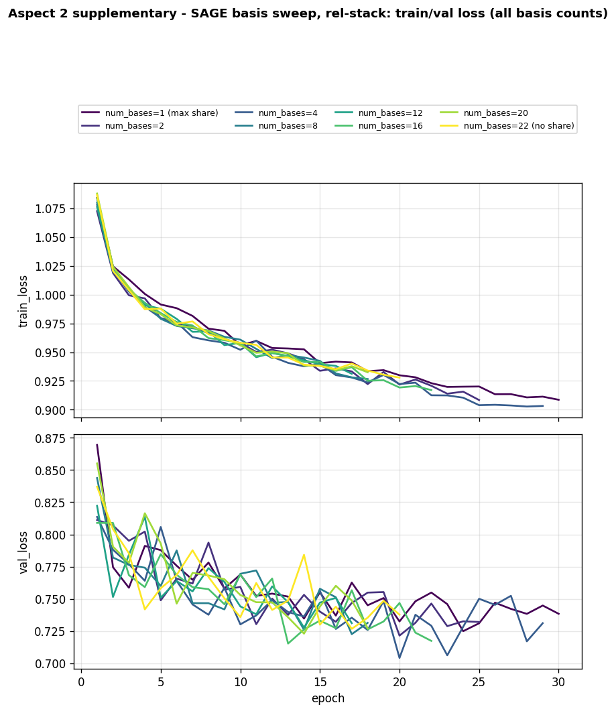
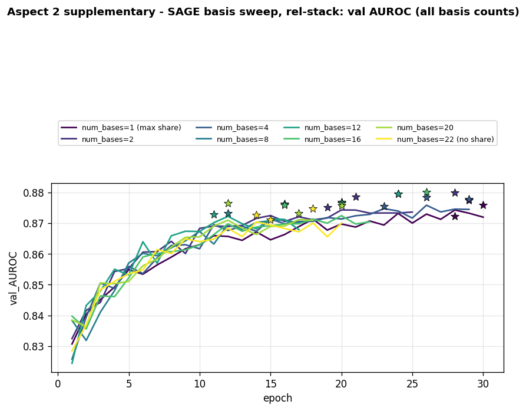
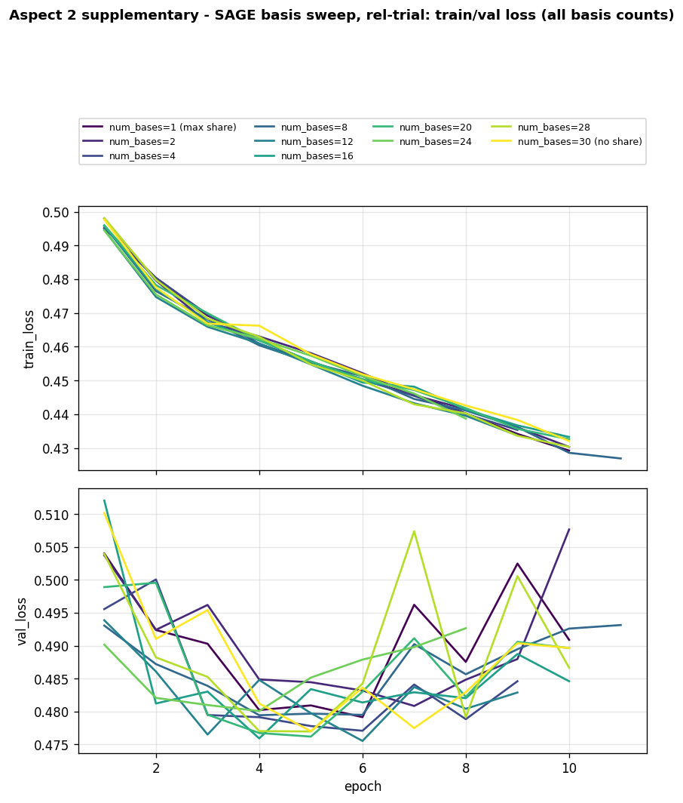
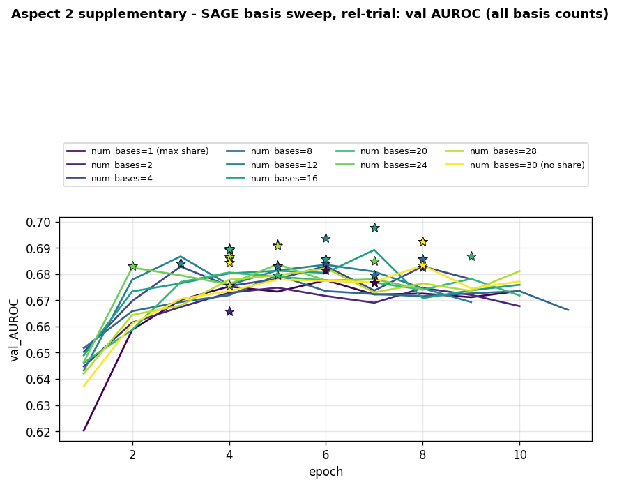
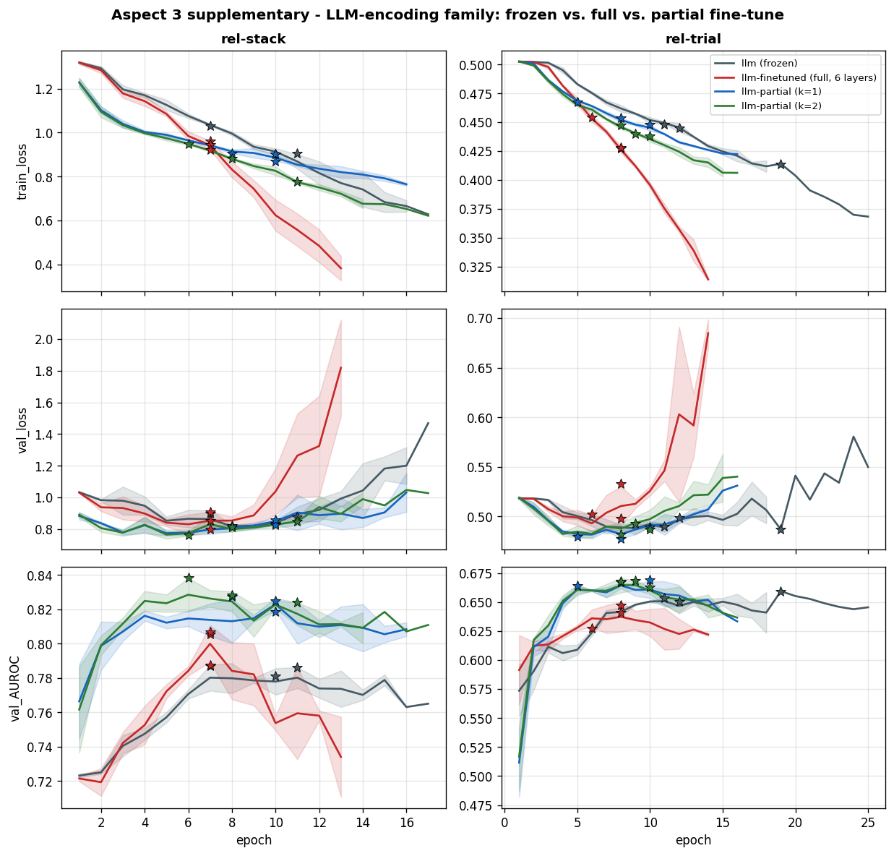

# Evaluating Aspects of Relational Deep Learning: An Ablation Study

**StructML (236605) - Final Project Report**

Authors: Abed-Al-Rahman Badran (325424752), Zina Assi (213813165)

## Abstract

Relational deep learning applies graph neural networks to graphs built from relational databases. We run a controlled ablation study of four design choices in such models - message directionality, graph heterogeneity, initial node features, and network depth - on two RelBench entity-classification tasks (rel-stack user-engagement, rel-trial study-outcome), holding encoders, sampling, and training protocol identical within each comparison and training every configuration on both datasets with 3 seeds to convergence. Our main findings: (1) forward-only message passing underperforms bidirectional passing, especially on rel-trial, across backbones; sharing weights across directions is a safe default. (2) Type-aware heterogeneous message passing is not a free win - it helps in only one of four model/dataset combinations tested, despite always costing more parameters. (3) Typed column encoders beat both frozen LLM row embeddings and featureless ID embeddings, consistently, on both datasets. (4) Deeper GCNs measurably oversmooth their representations, and skip connections counteract this and, on one dataset, translate into a real downstream gain at high depth. Our absolute numbers are broadly in line with public RelBench baselines on these two tasks.

---

## 1. Introduction

Relational deep learning turns a relational database into a heterogeneous graph, one node per table row with edges along primary-key/foreign-key links, and trains message-passing GNNs on it. Many design choices affect such a model: which direction messages flow, whether types are modeled explicitly, how a row becomes an initial node vector, and how deep the network should be. This project isolates each of these aspects and measures its contribution on two real prediction tasks, plus a dry design question on foundation models. Each aspect below follows the same template: the question being asked, the exact model architecture used (with a diagram), how the comparison is designed to isolate that one variable, the experimental setup, the results, whether training actually converged, and a discussion that explains the mechanisms behind what we observed rather than just restating the numbers.

## 2. Global Setup and Comparison-Design Protocol

This protocol is shared by every aspect, so the only thing that changes inside an experiment is the aspect being studied.

### Datasets and tasks

Two RelBench datasets, one binary entity-classification task each:

| Dataset | Task | Type | Target |
|---|---|---|---|
| rel-stack | user-engagement | binary classification | whether a user contributes in the next window |
| rel-trial | study-outcome | binary classification | whether a clinical study succeeds |

These are two very different domains - a Q&A community and clinical trials - so they let us check whether each effect generalizes rather than being specific to one dataset.

### Graph construction

Each database is turned into a heterogeneous graph (`HeteroData`): one node per table row, with edges following primary-key to foreign-key links. RelBench stores each link as a forward edge `f2p_<key>` and a reverse edge `rev_f2p_<key>`, so by default messages can flow in both directions. Row timestamps are attached as a time attribute, and we use the temporal train/validation/test splits defined by RelBench. Temporal splits plus time-aware neighbor sampling guarantee that a node never sees information from the future.

These first two steps are identical across every aspect in this report and are described here once rather than repeated in each aspect's own architecture description:

| # | Step | Input | What happens | Output |
|---|---|---|---|---|
| 1 | Raw RDB | the database's tables | every table row is about to become one graph node, every PK-FK link one edge | tables with typed columns |
| 2 | Build graph (`make_pkey_fkey_graph`) | all tables + their PK-FK links | one node per row (node type = table name); each PK-FK link becomes a forward edge `f2p_<key>` plus a reverse edge `rev_f2p_<key>`; row timestamps attached | the full heterogeneous graph (`HeteroData`) |

Each aspect's own Model Architecture section (3.2, 4.2, 5.2, 6.2) picks up from step 3 onward, where the aspect-specific sampling, encoding, or architecture choices begin.

### Default node features

For Aspects 1, 2, and 4, the initial node features come from column-wise encoders, the standard RelBench / torch_frame encoders that map each typed column to a numeric vector. Text columns are embedded using GloVe and randomly projected to 128 dimensions to bound memory. Aspect 3 is the experiment that varies this choice.

### Handling scale

rel-stack has on the order of four million nodes, so full-graph training does not fit in 8 GB. We use `NeighborLoader` mini-batching with a fixed fan-out per layer and per edge type, plus time-aware sampling. For the LLM feature experiment in Aspect 3, which is the heaviest, we take a fixed label-stratified subsample of seed entities together with their 2-hop neighborhoods and use the same subsample for all three feature strategies.

### Training protocol

`BCEWithLogitsLoss` with a positive-class weight for imbalance, Adam with a fixed learning rate (1e-3), a capped number of epochs, and early stopping on validation ROC AUC (the model with the best validation AUROC so far is checkpointed; if no improvement occurs for `patience` consecutive epochs, or the epoch cap is reached, that checkpoint - not the final epoch - is restored and used for evaluation). All results in this report use a **converged protocol**: up to 30 epochs, patience 6 (Aspect 4's depth sweep additionally caps mini-batches per epoch at 1000, since it trains 12 configurations per dataset), and **3 seeds (42, 43, 44) on both datasets** for every configuration; tables report the mean and standard deviation over seeds. We also log the learnable-parameter count and training time per run, and log per-epoch train loss, validation loss, and validation AUROC for every run - this underlies the loss-curve figures and is used directly in the Discussion wherever convergence or overfitting is relevant to a specific finding.

### Evaluation measures

For every experiment we report ROC AUC, AUPRC, precision, and recall. Precision and recall require a decision threshold, so we choose the threshold that maximizes F1 on the validation set. Because RelBench hides the test labels, every metric is reported on the validation split using that best-F1 threshold. This introduces a mild optimistic bias for precision and recall, but it is identical across variants, so it does not affect comparisons.

One additional methodological note we uncovered while auditing convergence: because `NeighborLoader`'s neighbor subsampling is not seeded at evaluation time (a node with more neighbors than the configured fan-out gets a random subset each call), two evaluations of the *same* restored checkpoint can differ slightly. We measured this directly by comparing each run's officially reported AUROC against the value logged for that same epoch during training: the discrepancy is negligible for Aspects 1-2 (mean |diff| ≈ 0.00003-0.00009, max ≈ 0.0005) and larger but still small for Aspect 4 (mean ≈ 0.0006, max ≈ 0.0046), where the fan-out (10) is tightest relative to real node degree. Aspect 3 shows zero discrepancy, because its cached subgraph rarely has any node exceeding its fan-out cap, so there is nothing to subsample. This noise is well below the effect sizes we report as real findings, but small gaps of a few thousandths in AUROC anywhere in this report should be read with this in mind.

### What our comparison design means

Inside each aspect we hold everything constant, the data splits, the seeds, the hidden size, the number of layers, the neighbor fan-out, the feature encoders, the prediction head, and the training schedule, and change only the aspect under study. Some aspects unavoidably change the parameter count - for example Dir-GNN uses separate weights per direction, and heterogeneous models duplicate weights per type. For those cases we report parameter counts directly, and where the higher-capacity model actually wins, we discuss whether the gain plausibly comes from the design choice or from extra capacity; Aspect 2 additionally includes a parameter-matched control.

### External sanity check (RelBench leaderboard)

Our GraphSAGE numbers are broadly consistent with RelBench's published LightGBM/RDL baselines on both tasks (a large RDL-over-LightGBM gap on user-engagement, comparable performance on study-outcome where the entity table is already feature-rich) - close enough given our lighter architecture and the validation-vs-test split difference. We found no official published numbers for GAT or HGT on these tasks, so the GAT-sensitivity and heterogeneity findings in this report rest on our own controlled comparisons alone, not on external corroboration.

---

## 3. Aspect 1 - Message Directionality

### 3.1 Question

On the relational PK-FK graph, how much does the direction of message passing matter, and does the answer depend on the aggregation mechanism (mean-aggregating GraphSAGE vs. attention-based GAT)?

### 3.2 Model Architecture

*Figure 1: shared pipeline for all six variants (2 backbones x 3 directionality modes). Raw tables are the inputs, boxes are numbered components, and the data flowing between them is written on the arrows; the bottom panels show how each mode wires the forward (`f2p_*`) and reverse (`rev_f2p_*`) edges.*

Every variant shares the same skeleton: a per-table `HeteroEncoder` maps each row's typed columns to a 128-dimensional vector; two message-passing layers (`SAGEConv` or `GATConv`, `heads=4` for GAT, head outputs averaged not concatenated) update node embeddings; a two-layer MLP head (`Linear(128,128) -> ReLU -> Linear(128,1)`) reads out the entity node's embedding into one logit. Only the wiring inside each `HeteroConv` layer changes between the three modes:

- **MPNN-D (directed):** only the forward edge types (`f2p_*`) get a convolution; information flows one way, from foreign-key row toward primary-key row.
- **MPNN-U (undirected):** forward and reverse edge types both get a convolution, but each reverse edge type's convolution module is literally the same object as its forward counterpart (`rel2conv[e[1]] = conv; convs[rev_e] = rel2conv[...]` in code), so the two directions share one learned transform.
- **Dir-GNN:** forward and reverse edge types each get their *own*, independently initialized convolution module, so the two directions never share weights.

Picking up from Section 2's shared steps 1-2: a `NeighborLoader` samples a 2-hop, time-respecting mini-batch of 512 labeled seed entities (step 3), the shared `HeteroEncoder` turns their typed columns into one 128-d vector per node (step 4), two message-passing layers update every node's embedding (steps 5-6), the batch's seed rows are read back out (step 7), and an MLP head produces one logit per seed (step 8). The **only** thing that differs between the six variants is step 5/6: which edge types are wired in and whether the two directions share weights (bottom of Figure 1), and whether the per-edge-type convolution is SAGEConv or GATConv.

### 3.3 Comparison Design

Layers, hidden size, fan-out (128 neighbors/layer/edge-type), encoders, and head are identical across all six variants; only the directionality mode and backbone change. In code, MPNN-U ties each reverse edge type's convolution to the *same module object* as its forward counterpart (`convs[e] = rel2conv[e[1][len("rev_"):]]`), so its message-passing weight count is identical to MPNN-D's by construction, not approximately similar - confirmed directly by the logged parameter counts, which match exactly between MPNN-D and MPNN-U in every one of the 12 backbone/dataset cells (e.g. rel-stack SAGE: 3,033,985 for both; rel-trial GAT: 10,266,113 for both). Dir-GNN's message-passing weights are exactly double, since every edge type gets its own, independently initialized module. At the *total* parameter level the ratio is smaller than 2x (1.13-1.56x across the four backbone/dataset combinations - see Table 1), because the shared `HeteroEncoder` contributes a fixed, mode-independent chunk of parameters that dilutes the doubling. We report all parameter counts directly rather than running a separate parameter-matched control, since Table 1 shows Dir-GNN's extra capacity never produces the outright best result on any backbone/dataset pair.

### 3.4 Experimental Setup

rel-stack and rel-trial, both under the global protocol (Section 2): 30-epoch budget, patience 6, 3 seeds, mean fan-out 128 per layer per edge type.

### 3.5 Results

**Table 1a - rel-stack**

| backbone | mode | AUROC | AUPRC | precision | recall | params |
|---|---|---|---|---|---|---|
| SAGE | MPNN-D | **0.8778 ± .0025** | 0.3064 | 0.352 | 0.342 | 3.03M |
| SAGE | MPNN-U | 0.8712 ± .0036 | 0.2826 | 0.324 | 0.347 | 3.03M |
| SAGE | Dir-GNN | 0.8751 ± .0082 | 0.3028 | 0.327 | 0.357 | 3.76M |
| GAT | MPNN-D | **0.8742 ± .0079** | 0.3121 | 0.342 | 0.362 | 5.22M |
| GAT | MPNN-U | 0.8721 ± .0021 | 0.3083 | 0.333 | 0.372 | 5.22M |
| GAT | Dir-GNN | 0.8633 ± .0050 | 0.2854 | 0.336 | 0.326 | 8.13M |

---

**Table 1b - rel-trial**

| backbone | mode | AUROC | AUPRC | precision | recall | params |
|---|---|---|---|---|---|---|
| SAGE | MPNN-D | 0.6715 ± .0013 | 0.7377 | 0.605 | 0.975 | 7.29M |
| SAGE | MPNN-U | 0.6863 ± .0020 | 0.7556 | 0.626 | 0.928 | 7.29M |
| SAGE | Dir-GNN | **0.6866 ± .0002** | 0.7569 | 0.615 | 0.948 | 8.27M |
| GAT | MPNN-D | 0.6467 ± .0043 | 0.7059 | 0.603 | 0.969 | 10.27M |
| GAT | MPNN-U | 0.6642 ± .0008 | 0.7332 | 0.599 | 0.980 | 10.27M |
| GAT | Dir-GNN | **0.6644 ± .0045** | 0.7314 | 0.621 | 0.936 | 14.23M |

*Figure 2: SAGE backbone, all three directionality modes, per-epoch train loss / validation loss / validation AUROC, mean ± std over 3 seeds, star = restored best epoch.*

*Figure 3: GAT backbone, same layout.*

### 3.6 Discussion

**On rel-stack, all three modes are close (0.863-0.878).** MPNN-D is nominally best for both backbones, but Dir-GNN is a close second for SAGE (0.8751 vs. 0.8778) while being clearly last for GAT (0.8633). The entity table (`users`) is a parent of posts, comments, and votes, so the forward edges already pull a user's own activity into the node; reverse edges add comparatively little, which is consistent with forward-only message passing losing nothing here.

GAT-MPNN-D's weak result on rel-trial is not just under-training: a confirmation run at 40 epochs and a 3x higher learning rate raised it only from 0.630 to about 0.648, still the worst mode, so the gap is a real optimization/architecture effect, not an artifact of budget.

**On rel-trial, the story flips: MPNN-D is clearly the worst mode for both backbones**, by 0.015 AUROC for SAGE (0.6715 vs. 0.6863-0.6866) and 0.018-0.020 for GAT (0.6467 vs. 0.6642-0.6644). The entity table (`studies`) reaches conditions, sponsors, and interventions only through junction tables, so relevant signal sits reachable only via reverse edges; cutting them off hurts regardless of aggregation mechanism, though the effect is larger in absolute terms for GAT (both because GAT's starting point is lower and because attention over a thinner, one-directional neighborhood has less to work with than mean-aggregation does).

**Why does Dir-GNN not win outright despite having up to 1.56x the parameters of MPNN-D/U?** Its message-passing weights are exactly double by construction (a fresh, independently initialized convolution per direction instead of one shared module), but this project's four aspects consistently show that more message-passing capacity does not automatically buy better generalization on these tasks. Dir-GNN's best showing is a statistical tie with MPNN-U on rel-trial for both backbones (SAGE: 0.6866 vs. 0.6863; GAT: 0.6644 vs. 0.6642, both differences well inside one standard deviation), never an outright win - a genuinely separate mechanism (a second copy of the same message, not a new signal) appears to add little beyond what shared bidirectional weights already extract.

**Takeaway.** MPNN-U (bidirectional, shared weights) is the safest default: never far from the best mode in either backbone/dataset combination, and it avoids MPNN-D's clear failure mode on rel-trial without paying Dir-GNN's parameter cost.

---

## 4. Aspect 2 - Heterogeneity

### 4.1 Question

Does treating the graph as heterogeneous, with typed nodes and edges, outperform treating it as homogeneous, with one node type and one edge type - and does the answer depend on whether the model family is GraphSAGE or HGT?

### 4.2 Model Architecture

*Figure 4: heterogeneous vs. homogeneous pipelines. Steps 1-4 (raw tables through the shared `HeteroEncoder`) and 9-10 (shared MLP head and output) are identical for all four variants; the two branches differ only in what happens between them.*

All four variants share the same per-table `HeteroEncoder`. The heterogeneous variants then run a `HeteroConv` (one `SAGEConv`, or native `HGTConv` with `heads=4`, applied per edge type) so type information is preserved through message passing. The homogeneous variants instead call `collapse()` before message passing, which converts the typed graph into an untyped one as follows:

1. Concatenate every node type's encoded embeddings into one matrix, recording each type's row-offset.
2. For every edge type `(s, rel, d)`, add `offsets[s]` to its source indices and `offsets[d]` to its target indices, then concatenate all edge-index tensors into one merged edge index.
3. Run **one** type-agnostic convolution on the merged `(x_all, edge_index_all)` - a plain `SAGEConv` for the SAGE-homo variant.
4. Slice the entity type's rows back out of the merged output using its stored offset, for the prediction head.

For **HGT-homo** specifically, the assignment requires literally disabling heterogeneity at the data level, not just algorithmically: we wrap the merged graph in an explicit single-type `HeteroData()` (`hom["node"].x = x_all`, `hom["node","to","node"].edge_index = ei_all`) before calling the same `HGTConv`, so its own type-lookup machinery sees exactly one node type and one edge type, matching the spec's construction exactly rather than only being computationally equivalent to it.

Picking up from Section 2's shared steps 1-2: a `NeighborLoader` samples a 2-hop, time-respecting mini-batch of 512 labeled seed entities, then the shared `HeteroEncoder` turns every node's typed columns into a 128-d vector, still kept separate per node type at this stage. The two branches diverge only at message passing (steps 5-7). **Heterogeneous:** two `HeteroConv` layers, each giving every edge type its own convolution and its own weights (per-edge-type `SAGEConv`, or a native `HGTConv` with per-node-type and per-relation projections for the HGT family); per-edge-type messages landing on the same node are summed. **Homogeneous:** `collapse()` first merges every node type's matrix into one `x_all` (recording each type's row offset) and every edge type's indices into one `edge_index_all` - after this, no type information remains - then **one** type-agnostic convolution runs on the merged graph, so every node aggregates all its neighbors with the same weights regardless of source table. Both branches then slice the entity type's rows back out (using the stored offset, in the homogeneous case) and feed them through the same MLP head. So the comparison isolates exactly one question: given identical inputs and an identical head, does message passing do better when every relation keeps its own weights, or when one shared set of weights treats the merged graph as a single homogeneous network?

### 4.3 Comparison Design

Everything but the message-passing block is held identical across all four variants; we report parameter counts directly (Table 2) since heterogeneous models always cost more, and ran a parameter-matched control (`homo-wide`, 6.72M params vs. hetero's 8.27M) for the one case heterogeneity won by a real margin (SAGE/rel-trial) - rel-stack's asymmetric result gets a more thorough capacity check instead, via Section 4.7's basis-decomposition sweep.

### 4.4 Experimental Setup

rel-stack and rel-trial, global protocol (Section 2).

### 4.5 Results

**Table 2a - rel-stack**

| model | setting | AUROC | AUPRC | precision | recall | params |
|---|---|---|---|---|---|---|
| SAGE | homo | **0.8800 ± .0033** | 0.3137 | 0.340 | 0.364 | 2.38M |
| SAGE | hetero | 0.8746 ± .0034 | 0.2996 | 0.348 | 0.344 | 3.76M |
| HGT | homo | 0.8680 ± .0027 | 0.2904 | 0.322 | 0.354 | 2.46M |
| HGT | hetero | 0.8699 ± .0086 | 0.2872 | 0.320 | 0.351 | 3.60M |

---

**Table 2b - rel-trial**

| model | setting | AUROC | AUPRC | precision | recall | params |
|---|---|---|---|---|---|---|
| SAGE | homo | 0.6645 ± .0062 | 0.7195 | 0.606 | 0.967 | 6.37M |
| SAGE | homo-wide (control) | 0.6684 ± .0081 | 0.7201 | 0.609 | 0.958 | 6.72M |
| SAGE | hetero | **0.6867 ± .0038** | 0.7523 | 0.609 | 0.971 | 8.27M |
| HGT | homo | 0.6713 ± .0055 | 0.7264 | 0.615 | 0.948 | 6.45M |
| HGT | hetero | 0.6707 ± .0084 | 0.7308 | 0.618 | 0.945 | 8.77M |

*Figure 5: SAGE family, homo vs. hetero (plus the homo-wide control on rel-trial), mean ± std over 3 seeds.*

*Figure 6: HGT family, same layout.*

### 4.6 Discussion

**On rel-stack, homogeneous SAGE wins clearly** (0.8800 vs. 0.8746, a gap larger than either model's own seed-to-seed standard deviation) **while HGT is a statistical tie** (0.8699 hetero vs. 0.8680 homo, gap smaller than hetero's own std of 0.0086) - a correction from an earlier, less-converged pass at this aspect that had reported homo beating hetero for both families on rel-stack. **On rel-trial, SAGE hetero wins clearly** (0.6867 vs. 0.6645, and the gap survives against the parameter-matched homo-wide control at 0.6684 - widening homo to match hetero's parameter count closes less than a fifth of the gap) **while HGT is again a tie** (0.6707 vs. 0.6713). Across all four model/dataset pairs, heterogeneity helps outright in exactly one (SAGE/rel-trial), ties in two (both HGT pairs), and loses in one (SAGE/rel-stack) - a more mixed picture than "opposite of expectation in most cases," but still far from the clear win we originally expected.

**Why do heterogeneous models have more parameters, and does that extra capacity help?** Heterogeneous message passing duplicates weights per edge type (`HeteroConv`) or maintains separate per-type projections (`HGTConv`'s internal type-specific linear layers), so hetero always costs more parameters than homo at the same hidden size - 1.30x to 1.58x more across our four pairs. The parameter-matched control directly answers whether that capacity, not type-awareness, is what wins on rel-trial: widening homo to hetero's parameter budget only recovers a small fraction of the gap (0.6645 to 0.6684, versus hetero's 0.6867), so the win is attributable to genuine type-awareness, not just having more weights to fit with.

**Why does homogeneous do about as well or better everywhere except SAGE/rel-trial?** Sharing one set of weights across all node and edge types pools statistical strength and acts as a regularizer. rel-stack has 22 edge types and rel-trial has 30; splitting parameters across that many types trains each type-specific transform on a thinner slice of the data, which can offset the benefit of type-awareness unless the types are distinct enough and the model family is well matched to exploiting them (SAGE's simple per-type linear-then-mean transforms on rel-trial's genuinely distinct table roles - studies vs. conditions vs. sponsors - appear to hit that sweet spot; HGT's larger, attention-based per-type machinery does not clearly benefit from the same split on either dataset).

**Takeaway.** Heterogeneity is not a free win: it must be tested per model family and per dataset, and on these tasks it earns its extra parameters in only one of four combinations.

### 4.7 Supplementary: Testing the Fragmentation Hypothesis via Basis Decomposition

This subsection reports a follow-up investigation beyond the assignment's Aspect 2 requirement (the assignment's model list for this aspect is GraphSAGE/GAT/HGT); it does not replace or count toward the official comparison above, which already fully satisfies the requirement on its own.

**Question.** rel-stack's 11 relations are severely imbalanced in edge count - `votes.UserId->users` has 5,182 edges versus `votes.PostId->posts`'s 1,199,831, a 232x gap - while rel-trial's 15 relations are comparatively balanced (about 10x top-to-bottom, no severe outlier). Does homogeneous SAGE beat heterogeneous SAGE on rel-stack because some relations' independent weight matrices are estimated from too little data, and does sharing weight structure across relations fix that?

**Method.** Since PyG's native basis-decomposition mechanism (the standard R-GCN fix for exactly this failure mode: each relation's weight matrix becomes a learned combination of a small shared set of `B` basis matrices, rather than a fully independent matrix) ships only on `RGCNConv`, we built a hand-written `BasisSAGEConv` that reproduces `SAGEConv`'s own formula (`out = lin_l(mean_neighbors) + lin_r(self)`, confirmed against PyG's source) with each relation's `lin_l`/`lin_r` constructed as `W = sum_b coef[rel,b] * basis[b]` instead of being independently owned. Relations targeting the same destination type are summed, matching the official `HeteroConv(..., aggr="sum")` exactly, so `num_bases = num_relations` (22 for rel-stack, 30 for rel-trial) serves as the "no sharing" reference point within this same SAGE family. Same 30-epoch/patience-6/3-seed protocol as everywhere else in this report. Swept `num_bases` over `{1, 2, 4, 8, 12, 16, 20, num_relations}`.

**Results.**

| num_bases | rel-stack AUROC | rel-trial AUROC |
|---|---|---|
| 1 | 0.8752 ± .0026 | 0.6826 ± .0063 |
| 2 | **0.8780 ± .0025** | 0.6773 ± .0100 |
| 4 | 0.8772 ± .0015 | 0.6868 ± .0047 |
| 8 | 0.8755 ± .0020 | 0.6828 ± .0032 |
| 12 | 0.8774 ± .0039 | 0.6880 ± .0051 |
| 16 | 0.8775 ± .0023 | **0.6912 ± .0061** |
| 20 | 0.8752 ± .0017 | 0.6854 ± .0051 |
| 24 | - | 0.6866 ± .0045 |
| 28 | - | 0.6844 ± .0080 |
| 22 / 30 (full, no sharing) | 0.8729 ± .0017 | 0.6868 ± .0050 |

*Figure 7: rel-stack, train/val loss for every swept basis count, mean over 3 seeds.*

*Figure 8: rel-stack, validation AUROC for every swept basis count, mean over 3 seeds, star = restored best epoch.*

*Figure 9: rel-trial, train/val loss for every swept basis count, mean over 3 seeds.*

*Figure 10: rel-trial, validation AUROC for every swept basis count, mean over 3 seeds, star = restored best epoch.*

**Convergence.** 51 of 54 (num_bases, seed) runs converged before the epoch cap (21/24 rel-stack, 30/30 rel-trial); the 3 exceptions (rel-stack `num_bases=1` seeds 42 and 43, `num_bases=4` seed 43) were still improving slightly at epoch 30, a minor caveat given rel-stack's own spread across basis counts is only about 0.005. Eval-time neighbor-sampling noise (Section 2) measured at mean |diff| = 0.00003, max = 0.0002 across all 54 runs - consistent with the rest of this report.

**On rel-stack, there is a real sweet spot.** AUROC rises from `num_bases=1` (0.8752) to a plateau around `num_bases=2-16` (0.877-0.878), then drops at `num_bases=22` (0.8729) - the full-independence, no-sharing endpoint is the *worst* point in the entire sweep, below even the official hetero result (0.8746). The best point (`num_bases=2`, 0.8780) closes about 63% of the gap between official hetero (0.8746) and homo (0.8800). This is real, verified evidence that fragmenting parameters across rel-stack's severely imbalanced relations costs real performance, and that moderate sharing recovers a substantial part of it. It does not, however, fully close the gap to homo - the best basis-decomposition point still falls about 0.002 short of homo's 0.8800, so parameter fragmentation is a real, substantial, but incomplete explanation for why homogeneous wins on rel-stack.

**On rel-trial, basis count barely matters.** All ten points sit in a 0.677-0.691 band, mostly within each point's own seed-to-seed noise - consistent with rel-trial's relations not having a severely under-trained outlier for sharing to rescue. `num_bases=30` (0.6868) lands almost exactly on the official hetero result (0.6867), a clean sanity check that `BasisSAGEConv` correctly reproduces independent per-relation weights when given enough bases. rel-stack's equivalent check is looser (0.8729 vs. official hetero's 0.8746) - plausibly optimization variance, since a basis-decomposed layer at `num_bases = num_relations` has strictly more raw parameters than a plain independent `SAGEConv` per relation (the combination-coefficient matrix is extra), not a smaller or differently-shaped model.

We do not identify a specific mechanism for the remaining ~37% of the gap on rel-stack in this report; testing one (for example, whether the per-relation-mean-then-sum pooling that both hetero and this basis-decomposed variant share, as opposed to homo's single pooled mean over all neighbors regardless of type, is itself part of the answer) is left to future work.

---

## 5. Aspect 3 - Node Features

### 5.1 Question

In the heterogeneous setting, how does the initial node representation affect downstream performance, model complexity, and usability?

### 5.2 Model Architecture

*Figure 11: three swappable input encoders feeding an identical HGT backbone and head. Each encoder consumes a different view of the same row (its index only, its typed cell values, or its serialization to text); all three emit the same 128-d node vector.*

All three variants share the exact same downstream model: two `HGTConv` layers (`heads=4`) followed by the same two-layer MLP head. Only the block that produces each node's initial 128-dimensional vector changes:

- **id:** `nn.Embedding(num_nodes_of_type, 128)` per node type, looked up by the node's position in the cached subgraph - a pure lookup table, ignoring all cell values, and transductive by construction (a validation entity's own embedding is only trained if it happens to appear as a neighbor of some training entity's sampled neighborhood).
- **column:** the shared `HeteroEncoder` used everywhere else in this project (torch_frame typed-column encoders).
- **llm:** each row is serialized to a string (`"col1=v1, col2=v2, ..."`), embedded once with frozen sentence-transformers MiniLM (`all-MiniLM-L6-v2`, 384-d), and a learned per-type `Linear(384, 128)` projects it down; MiniLM itself is never fine-tuned.

Picking up from Section 2's shared steps 1-2: a fixed, cached subsample is drawn **once** per dataset (6000 train seeds; validation requested at 2000 but capped by each dataset's actual validation-table size - rel-stack reaches 2000, rel-trial caps at 960) with 2-hop `[6,6]`-fanout neighborhoods, reused identically by all three strategies and all seeds (step 3). Exactly one of three encoders is then active per run (step 4): `id` looks up a pure per-node embedding from the node's index alone, ignoring every cell value; `column` uses the same `HeteroEncoder` as every other aspect; `llm` serializes each row to text, embeds it once with frozen MiniLM, and projects it down with a learned linear layer. Steps 5-8 (two `HGTConv` layers, taking the seed rows, and the MLP head) are bit-for-bit identical across all three strategies, so any performance difference is attributable to the initial node representation alone.

### 5.3 Comparison Design

Fixed cached subsample, fan-out, and MiniLM embeddings precomputed once (Section 5.2) - identical for all three strategies, which is both the assignment's requirement and what makes `id`'s transductive weakness a fair test rather than a sampling artifact: every strategy sees the same validation entities.

### 5.4 Experimental Setup

rel-stack and rel-trial, global protocol (Section 2), fan-out [6, 6] on the cached subgraph rather than the full graph.

### 5.5 Results

**Table 3a - rel-stack**

| strategy | AUROC | AUPRC | learned params |
|---|---|---|---|
| id | 0.7117 ± .0118 | 0.0556 | 25.57M |
| column | **0.8402 ± .0064** | 0.1772 | 3.60M |
| llm | 0.7849 ± .0031 | 0.1531 | 1.65M |

---

**Table 3b - rel-trial**

| strategy | AUROC | AUPRC | learned params |
|---|---|---|---|
| id | 0.5145 ± .0328 | 0.5889 | 18.40M |
| column | **0.6769 ± .0022** | 0.7386 | 8.77M |
| llm | 0.6545 ± .0045 | 0.7489 | 3.23M |

*Figure 12: all three strategies, per-epoch curves, mean ± std over 3 seeds.*

### 5.6 Discussion

**The ordering is clean and consistent: column > llm > id on both datasets.** Typed column encoders carry the most signal because they preserve numeric precision and categorical structure directly; id and llm both discard or reshape that structure in different ways.

**Why does id have by far the most parameters (18-26M - 2.1x-7.1x column's and 5.7x-15.5x llm's, depending on dataset) yet the worst performance?** Its parameter count is an embedding table sized to the number of nodes in the sampled subgraph, not to the schema - about 95% of those parameters are raw per-node lookup slots that encode "which specific node this is," not any pattern transferable to a node the model has not seen trained. On rel-stack it still reaches 0.7117, meaning a user's 2-hop neighborhood carries real engagement signal even with zero cell values; on rel-trial it is close to chance (0.5145) because a validation study's own embedding was likely never updated during training, and pure connectivity carries little outcome signal there. This is a direct illustration of the point in Section 4's discussion generalized further: raw parameter count is not capacity in any useful sense when those parameters cannot transfer to unseen entities.

id's rel-trial AUPRC (0.5889) looks like a separate anomaly next to its near-chance AUROC (0.5145) - column and llm's AUPRC (0.7386, 0.7489) are much closer to their own AUROC in relative terms - but it is not: AUROC's chance floor is always 0.5 regardless of class balance, while AUPRC's chance floor is the positive-class prevalence. rel-trial's validation split is 58.44% positive (Section 5.3), and id's measured AUPRC (0.5889) sits within 0.0045 of that 0.5844 prevalence - almost exactly where a ranking with no real signal would land. Both numbers are telling the same story (id is barely better than random on rel-trial), just against each metric's own baseline.

The 25.57M/18.40M parameter count is wasteful in that sense, but not in wall-clock terms: `id`'s best epoch lands at epoch 2-3 on rel-stack and 2-5 on rel-trial, and training stops entirely by epoch 8-11 once patience runs out - both datasets' validation AUROC is already declining by epoch 5, not merely plateaued. Measured training time confirms this: `id` is the *cheapest* of the three strategies to train (12.7s/33.4s mean per run on rel-stack/rel-trial), against column's 30.6s/60.4s and llm's 19.9s/68.5s - despite owning 5-16x more parameters than either. Early stopping catches the collapse quickly enough that the large embedding table costs comparatively little compute, even though it is trained pointlessly.

**Limitation.** This "we're fine on compute" conclusion is protocol-dependent, not a general property of `id`: it holds here specifically because patience is short (6 epochs) and tuned for this project's other strategies, and because validation AUROC happens to peak and decline within the first few epochs on both datasets. A task where `id` overfits more slowly, or a patience setting tuned differently, would not get this same free pass. It is also a wall-clock argument only - the 18-26M-parameter embedding table is still allocated in memory for the full run regardless of how few epochs it trains for, and at true production scale (a graph with hundreds of millions of nodes rather than the ~189K in our cached subgraph) that memory footprint, not training time, would be the binding constraint.

**Why does llm not beat column despite having a strong pretrained encoder behind it?** Two compounding reasons. First, serializing a row into one string flattens numeric and categorical structure into text tokens, discarding exactly the structure column-wise encoding preserves directly. Second, MiniLM is frozen; only a linear projection is learned on top, giving llm the fewest learned parameters of the three strategies (1.65M / 3.23M) and correspondingly the least room to adapt to the task. llm's margin over id does grow from rel-stack (+0.073) to text-heavy rel-trial (+0.140), confirming language-model embeddings do capture textual signal where it exists - just not enough to close the gap to typed encoding.

**Usability.** id is trivial to implement (an embedding table) but not transferable to new entities; column-wise needs `torch_frame` and typed-column metadata; llm needs `sentence-transformers` plus a row-serialization and embedding pipeline, the heaviest one-off preprocessing cost of the three despite its light final parameter count.

### 5.7 Supplementary: Fine-Tuning the LLM Encoder

This subsection reports a follow-up investigation beyond the assignment's Aspect 3 requirement; the official `id`/`column`/`llm` comparison above already fully satisfies it on its own.

**Question.** The frozen `llm` strategy never lets MiniLM adapt to the task - only a linear projection on top is trained. Does letting MiniLM itself train close the gap to `column`, and if the naive version of that (fine-tune the whole model) does not work, does a more careful version?

**Method, in two stages.** First, a full fine-tune: all of MiniLM (~22.7M params) trained end-to-end, discriminative learning rate (MiniLM at `2e-5`, everything else at the usual `1e-3`), on the same 6,000/2,000 shared sample as the other three strategies. This came out *worse* than frozen on rel-trial (0.6388 vs. 0.6545) - diagnosed as overfitting: at that sample size there are only about 12 batches per epoch, so a 30-epoch budget means the model sees the same ~12 batches up to 30 times, and 22.7M trainable parameters is a lot of capacity to fit repeatedly to that little data. Second, a follow-up testing that diagnosis directly with two changes at once: (a) freeze all but the last 1 or 2 MiniLM transformer layers (`k=1`: 1.77M trainable params, `k=2`: 3.55M - both confirmed by direct inspection of which parameters receive gradient, with zero leakage either direction), and (b) train on a separately-cached, 5x larger sample (30,000 train / 10,000 validation seeds) built specifically for this follow-up, not shared with the official three strategies. Same 30-epoch/patience-6/3-seed protocol otherwise.

**Results.**

| dataset | strategy | AUROC | AUPRC | learned params |
|---|---|---|---|---|
| rel-stack | llm (frozen) | 0.7849 ± .0031 | 0.1531 | 1.65M |
| rel-stack | llm-finetuned (full, 6 layers, shared sample) | 0.8000 ± .0107 | - | 24.36M |
| rel-stack | llm-partial (k=1, larger sample) | 0.8238 ± .0045 | 0.1788 | 3.42M |
| rel-stack | llm-partial (k=2, larger sample) | **0.8303 ± .0073** | 0.1973 | 5.20M |
| rel-stack | column (reference) | **0.8402 ± .0064** | 0.1772 | 3.60M |
| rel-trial | llm (frozen) | 0.6545 ± .0045 | 0.7489 | 3.23M |
| rel-trial | llm-finetuned (full, 6 layers, shared sample) | 0.6388 ± .0104 | - | 25.94M |
| rel-trial | llm-partial (k=1, larger sample) | **0.6667 ± .0024** | 0.7508 | 5.00M |
| rel-trial | llm-partial (k=2, larger sample) | 0.6665 ± .0030 | 0.7411 | 6.78M |
| rel-trial | column (reference) | **0.6769 ± .0022** | 0.7386 | 8.77M |

*Figure 13: frozen vs. full fine-tune vs. partial fine-tune (k=1, k=2), mean ± std over 3 seeds, star = restored best epoch.*

**Convergence.** All 12 partial-fine-tune runs converged cleanly before the epoch cap (best epochs ranging 5-11, ordinary early stopping, no run still improving at epoch 30) and the officially reported AUROC matched the logged curve value exactly for every run (mean and max |diff| = 0.0). The full fine-tune's overfitting is directly visible in Figure 13: its validation loss (red) drops briefly then rises sharply past its starred best epoch on both datasets, most dramatically on rel-trial, while both partial variants (blue, green) stay flat and stable well past their own best epochs - a visibly different failure mode, not just a different number.

**The diagnosis holds up: partial fine-tuning plus more data beats both frozen and full fine-tuning, on both datasets.** On rel-stack, ordering is frozen (0.7849) < full-finetune (0.8000) < k=1 (0.8238) < k=2 (0.8303) < column (0.8402): k=2 closes 82% of the gap between frozen and column, versus full fine-tuning's 27%. On rel-trial, ordering is full-finetune (0.6388) < frozen (0.6545) < k=2 (0.6665) ≈ k=1 (0.6667) < column (0.6769): partial fine-tuning does not just improve on full fine-tuning, it reverses the regression entirely and closes about 55% of the frozen-to-column gap, while full fine-tuning had moved *away* from column. Restricting how many layers can adapt, combined with enough data that those layers do not just memorize a small repeated sample, is what full fine-tuning was missing on both datasets.

**k=1 vs. k=2.** On rel-stack, k=2 clearly beats k=1 (0.8303 vs. 0.8238) - more adaptable capacity helps when there is more, and more textually rich, content to adapt to (rel-stack's `posts` and `postHistory` node types carry long free-text bodies). On rel-trial, k=1 and k=2 are statistically tied (0.6667 vs. 0.6665, well inside one standard deviation) - one unfrozen layer is already enough to capture what rel-trial's shorter, more uniform text has to offer, and the second unfrozen layer adds capacity without adding benefit.

**Even partial fine-tuning does not fully close the gap to column** (0.0099 short on rel-stack, 0.0102 short on rel-trial) - consistent with this report's broader Aspect 3 finding that serializing a row into text discards some structure no amount of adaptation recovers, while adaptation capacity and data volume separately explain why the frozen and fully-fine-tuned versions underperformed by more than that residual amount.

---

## 6. Aspect 4 - Limitations of Deeper Models (Oversmoothing)

### 6.1 Question

As we add layers, do node representations collapse toward each other (oversmoothing), and does that hurt downstream performance? Does adding skip connections mitigate it?

### 6.2 Model Architecture

*Figure 14: the depth-configurable GCN stack. The arrows carry the data at each step (`h^(0)` after `collapse()`, `h^(l)` between repeated layers, `h^(L)` into the head); the optional skip connection is shown looping the layer input around each `GCNConv`.*

A homogeneous operator (GCN was chosen because oversmoothing was first characterized in this model family): the same per-table `HeteroEncoder` as every other aspect, followed by Aspect 2's `collapse()` to merge the typed graph into one node/edge set, then `L` stacked `GCNConv` layers (`L` in `{1,2,3,4,6,8}`), then the same MLP head. Each layer computes `h = relu(conv(h_prev))` in the baseline, or `h = relu(h_prev + conv(h_prev))` in the skip variant - a residual connection carrying the previous layer's representation forward.

Picking up from Section 2's shared steps 1-2: a `NeighborLoader` samples a **fixed** 2-hop mini-batch (256 seed entities, fanout 10) that is handed identically to every depth setting, so `L` never changes what the model can see, only how many times it processes it (step 3); the shared `HeteroEncoder` produces a 128-d vector per node (step 4); `collapse()` merges the typed graph into one node/edge set exactly as in Aspect 2 (step 5); a `GCNConv` stack repeats `L` times (`L` in `{1,2,3,4,6,8}`), either `h^(l) = ReLU(conv(h^(l-1)))` (baseline) or with a residual skip added before the ReLU (step 6, the tensor the smoothing metrics are computed on); the entity rows are sliced back out and read through the same MLP head (steps 7-8). Only step 6 changes across the twelve configurations (the value of `L`, and skip vs. no-skip); everything else is identical everywhere.

### 6.3 Comparison Design

The critical design choice for isolating depth is a **fixed 2-hop sampled subgraph** (`NeighborLoader` with `[10, 10]`): the subgraph handed to the model is identical across every depth setting, and only the number of `GCNConv` layers applied to it changes. This means depth here means "more propagation rounds over the same neighborhood," not "a larger receptive field" - a depth-dependent sampler would instead grow the subgraph exponentially and exceed the 8 GB budget. Encoder, features, sampled subgraph, and training budget are identical across all twelve depth/skip settings; only `L` and the presence of the skip connection change.

### 6.4 Experimental Setup

rel-stack and rel-trial, global protocol (Section 2), fan-out [10, 10], max 1000 mini-batches/epoch (this aspect trains 12 configurations per dataset per seed, so the per-epoch budget is capped tighter than Aspects 1-3).

### 6.5 Results

Reading the two smoothing columns: `cos_sim` is a mean pairwise cosine similarity across node embeddings, so **higher means more collapsed** (all nodes pointing the same direction, toward 1); `dir_energy` is a neighbor-distance measure, so **lower means more collapsed** (neighbors have converged to near-identical embeddings, toward 0). The two move in opposite directions under oversmoothing by construction - watch for `cos_sim` rising together with `dir_energy` falling as the collapse signature, not either column alone. (Full definitions and how they relate to Tutorial 7's formulas are in Section 6.7.)

**Table 4a - rel-stack**

| depth | AUROC no-skip | AUROC skip | cos_sim no-skip | cos_sim skip | dir_energy no-skip | dir_energy skip |
|---|---|---|---|---|---|---|
| 1 | 0.8808 | 0.8821 | 0.453 | 0.497 | 0.720 | 0.692 |
| 2 | 0.8836 | 0.8837 | 0.676 | 0.557 | 0.290 | 0.548 |
| 3 | 0.8828 | 0.8839 | 0.576 | 0.577 | 0.375 | 0.551 |
| 4 | 0.8807 | 0.8847 | 0.720 | 0.566 | 0.247 | 0.564 |
| 6 | 0.8787 | 0.8860 | 0.709 | 0.486 | 0.262 | 0.772 |
| 8 | 0.8788 | **0.8881** | 0.712 | 0.552 | 0.390 | 0.823 |

---

**Table 4b - rel-trial**

| depth | AUROC no-skip | AUROC skip | cos_sim no-skip | cos_sim skip | dir_energy no-skip | dir_energy skip |
|---|---|---|---|---|---|---|
| 1 | 0.6704 | 0.6670 | 0.389 | 0.387 | 0.772 | 1.221 |
| 2 | 0.6829 | 0.6809 | 0.454 | 0.437 | 0.494 | 0.773 |
| 3 | **0.6893** | 0.6799 | 0.518 | 0.425 | 0.338 | 0.764 |
| 4 | 0.6857 | 0.6809 | 0.589 | 0.525 | 0.255 | 0.630 |
| 6 | 0.6729 | 0.6797 | 0.573 | 0.579 | 0.264 | 0.503 |
| 8 | 0.6757 | 0.6811 | 0.616 | 0.686 | 0.201 | 0.348 |

*Figure 15: depths 1 and 2, solid = no-skip, dashed = skip.*

*Figure 16: depths 3 and 4, same layout.*

*Figure 17: depths 6 and 8, same layout - the panel where the skip-vs-no-skip separation is clearest.*

### 6.6 Discussion

**Representations measurably oversmooth with depth, cleanest on rel-stack.** Without skips, `cos_sim` rises from 0.453 at L=1 toward roughly 0.71-0.72 by L=6-8 and `dir_energy` falls from 0.720 toward 0.25-0.39 - both signatures of node embeddings converging toward each other. rel-trial shows the same direction with more noise.

**Skip connections counteract collapse at the representation level, and on rel-stack this now translates into a real downstream effect.** With the fully-converged protocol, the no-skip downstream AUROC on rel-stack actually declines mildly with depth (0.8836 at L=2 down to 0.8788 at L=8), while the skip variant *rises* with depth (0.8821 at L=1 up to 0.8881 at L=8) - the skip-vs-no-skip gap grows from a negligible +0.0013 at L=1 to a clear +0.0093 at L=8, and `dir_energy` stays far higher with skips at every depth beyond one (0.823 vs. 0.390 at L=8). This is a cleaner confirmation of the textbook oversmoothing-and-mitigation story than an earlier, shorter-budget pass at this aspect had shown. On rel-trial the pattern is noisier and closer to a genuine rise-then-fall: no-skip AUROC peaks at L=3 (0.6893) and dips through L=6 (0.6729) before partially recovering, and skip's advantage is concentrated at the largest depths (L=6, L=8), where it clearly exceeds no-skip, while trailing it at shallower depths.

**Why does downstream AUROC stay comparatively flat on rel-stack despite visible representational collapse, when the classic oversmoothing story predicts a rise-then-fall?** Two design choices we made explicitly for tractability both work against seeing a large downstream drop. First, the receptive field is fixed at 2 hops by construction - depth here adds propagation *rounds* over the same neighborhood, not new information, so a deeper model mostly re-mixes signal the first layer or two already captured rather than losing access to it. Second, early stopping selects the best validation checkpoint for every depth, which absorbs much of the optimization difficulty that would otherwise show up as a widening performance gap for deeper, harder-to-train models. A full-graph or growing-receptive-field version of this experiment, infeasible under our 8 GB budget, would be a natural way to test whether a stronger downstream collapse appears once depth also means "sees more of the graph," not just "processes the same neighborhood more times."

### 6.7 Limitations

This study uses one model family, GCN, as the assignment allows, and the fixed-subgraph design specifically tests additional propagation rounds rather than a genuinely growing receptive field. The smoothing measures (`cos_sim`, `dir_energy`) are similarity metrics in the spirit of Tutorial 7 rather than exact reproductions of its formulas: `cos_sim` is a global mean pairwise cosine over a random node sample rather than neighbor-restricted, and `dir_energy` is computed on L2-normalized embeddings, making it proportional to a neighbor `(1 - cosine)` quantity rather than the tutorial's raw-embedding Dirichlet energy; both remain valid monotone collapse indicators.

---

## 7. Aspect 5 - Foundation Models (Dry Question)

We take HGT, one of our heterogeneous models, and describe what must change for it to be pretrained on one database and reused on another database with a different schema, so that pretraining can help.

### 7.1 The core blocker: HGT's architecture is schema-coupled

HGT's attention mechanism is built from three sets of weight matrices - query, key, and value projections - each indexed **per node type** and **per relation**: `W_Q^(τ)`, `W_K^(τ)`, `W_V^(τ)` for node type `τ`, plus a separate attention/message weight per relation. These matrices are initialized and trained against the source schema's specific type and relation *names*. There is no way to port them to a target database with different table names, a different number of tables, or different column dimensions - a type the model never saw during pretraining simply has no row in any of these weight tensors to look up. Every other required change below is secondary to this one: none of them matter if the backbone itself cannot accept an unfamiliar schema as input in the first place.

The fix, following the fact-encoding and cross-attention design used by Griffin (Wang et al., ICML 2025) and Relational Transformers: replace HGT's type-indexed weight *lookup* with weights *generated on the fly* from a schema description. A frozen text encoder reads each node type's and relation's name (e.g. "studies", "conditions", the foreign-key attribute name linking them) and outputs the corresponding projection matrices - a hypernetwork-style projection, not a fixed table. An unseen type at inference time still produces a valid projection, because it is generated from its name rather than looked up by an index that only exists for schemas seen during pretraining.

### 7.2 Required changes, mapped to seven design axes

- **Handling unknown schema.** Today: per-node-type weight matrices `W_Q^(τ)`, `W_K^(τ)`, `W_V^(τ)` hard-coded to the source schema's node types. Fix: replace them with a text encoder that embeds node-type and column names into vectors, so unseen types produce a valid embedding at inference time (Griffin, Relational Transformers).
- **What is encoded, and dimension mismatch.** Today: per-table column encoders trained on a fixed schema, each node type with a fixed feature dimension. Fix: encode at the cell level - per-cell type-specific encoders (numeric / text) aggregated into one row vector via cross-attention, Griffin's fact-encoding design.
- **Handling relational structure.** Today: attention uses per-relation weight tensors, again schema-specific. Fix: a schema-agnostic MPNN that encodes edge types from their textual metadata (table names, FK attribute name) rather than a lookup index, as Griffin does.
- **Type of generalization.** Today: none - fully transductive, no transfer mechanism at all. Fix: target fine-tuning (PEFT-style, e.g. TabLLM's IA³ scaling vectors) on the target database; zero-shot transfer (as Relational Transformers attempt) is the more ambitious alternative, but fine-tuning is the more realistic target given HGT's graph-structured inductive bias.
- **Specifying the prediction task.** Today: a hard-coded binary-classification head fixed at training time. Fix: frame the task as masked-cell prediction - given a row and a masked column, predict its value - schema-agnostic and transferable across tasks (the framing both Griffin and Relational Transformers use).
- **Handling different task types.** Today: `BCEWithLogitsLoss` only, binary classification. Fix: a dual decoder - one pretrained classification head, one pretrained regression head - selected by the target column's data type, as in Griffin.
- **Training strategy.** Today: supervised on one database, with that database's fixed labels. Fix: two-stage pretraining - single-table masked-cell prediction on diverse tabular data, then relational masked-cell prediction across multi-table databases - Griffin's curriculum.

### 7.3 Proposed experiment

Pretrain HGT-FM (the architecture above) on rel-stack using masked-cell completion: mask 15% of cell values at random and predict them. Transfer to rel-trial under three regimes:

1. **Zero-shot** - run the pretrained model directly on rel-trial, no gradient update.
2. **Full fine-tune** - unfreeze all parameters, train on rel-trial with task labels.
3. **PEFT fine-tune** - freeze the backbone, train only IA³-style scaling vectors (~0.01% of parameters), following TabLLM.

Vary the label fraction available on rel-trial - `{1%, 5%, 10%, 50%, 100%}` - and compare all three regimes against a from-scratch HGT baseline trained on rel-trial alone at each label fraction. Plot ROC AUC against label fraction for all four curves (scratch, zero-shot, full fine-tune, PEFT).

**What would count as a positive result.** Pretraining is effective if fine-tune or PEFT beats the from-scratch baseline in the low-label regime (<=10% of labels) - the regime where a pretrained prior should matter most and scratch training is starved of data. Zero-shot beating a random baseline at all would be a strong result on its own, given HGT was never trained on rel-trial's schema. The headline finding to look for: PEFT at 10% of rel-trial's labels matching full fine-tuning at 100% - that would mean the pretrained backbone had already learned most of what rel-trial's task needs, and only a small, cheap adaptation is required to specialize it.

---

## 8. Summary

### 8.1 Overview

**Aspect 1 - Message directionality.** We compared MPNN-D, MPNN-U, and Dir-GNN under identical encoders, depth, fan-out, and training, on both GraphSAGE and GAT. We found directionality has only a small effect on rel-stack (all modes within 0.86-0.88 for both backbones), but a clear one on rel-trial, where forward-only MPNN-D underperforms bidirectional passing for both backbones (by 0.015-0.020 AUROC), most severely for GAT. Dir-GNN never wins outright despite its extra parameters, at best tying MPNN-U. MPNN-U (bidirectional, shared weights) is the safest default.

**Aspect 2 - Heterogeneity.** We compared homogeneous and heterogeneous versions of GraphSAGE and HGT, with a parameter-matched control on the one case where heterogeneity won by a real margin. Heterogeneity helps outright in one of four model/dataset combinations (SAGE on rel-trial, confirmed against the capacity-matched control), ties in two (both HGT pairs), and loses in one (SAGE on rel-stack). Heterogeneity is not a free win: shared parameters can pool statistical strength across many types, while type-specific parameters can fragment the data and under-train.

**Aspect 3 - Node features.** We compared id, column-wise, and LLM encodings in HGT on a shared subsample. The result is a clean, consistent ordering: column-wise > LLM > id on both datasets. Typed column encoders are the best default; id shows that graph structure alone carries some signal but generalizes poorly to unseen entities (near-chance on rel-trial); LLM features help more where the schema is text-heavy but never overtake typed encoding, since serialization discards structure a frozen encoder cannot recover.

**Aspect 4 - Depth and oversmoothing.** We tested GCN with and without skip connections across depths 1 through 8 on a fixed 2-hop receptive field. Representational collapse is clearly present and grows with depth; skip connections measurably counteract it, and on rel-stack this now translates into a real downstream gain that grows with depth (up to +0.0093 AUROC at L=8). The muted downstream effect relative to the classic oversmoothing story is attributable to the fixed receptive field (depth adds propagation rounds, not new information) and early stopping.

**Aspect 5 - Foundation models.** HGT's core blocker is that its attention weights are indexed per node type and per relation against the source schema, with no way to handle an unfamiliar type or relation at inference time; the fix is to generate those weights from schema text (node/column/relation names) instead of looking them up, following Griffin and Relational Transformers, alongside a schema-agnostic masked-cell pretraining objective and a dual classification/regression decoder. Effectiveness should be tested by pretraining on rel-stack and transferring to rel-trial under zero-shot, full fine-tune, and PEFT (IA³) regimes across a label-fraction sweep, compared against a from-scratch baseline.

### 8.2 Future work

The main limitations are that all reported metrics are on the validation split because RelBench hides test labels, with the precision/recall threshold tuned on that same split; the depth study uses a fixed 2-hop subgraph rather than a growing receptive field; only two datasets are used; and only Aspect 2 includes a parameter-matched control. Good follow-ups would be a growing-receptive-field oversmoothing study on larger hardware, parameter-matched controls for Aspects 1, 3, and 4, fine-tuned rather than frozen LLM encoders, and additional RelBench tasks to test generality.

### 8.3 AI usage

We used an AI assistant (Claude, via Claude Code) extensively: drafting the experimental design, writing the PyTorch Geometric / RelBench implementation of every aspect, debugging environment and library failures, generating figures, and drafting report text from measured results. Every experimental decision and all training runs were made, launched, and monitored by us. Our validation process included smoke-testing every component before touching real datasets, verifying claims directly against code and data rather than trusting AI-generated prose (e.g. confirming parameter-tying claims, auditing every reported number against the saved CSVs, and cross-checking results against training curves before trusting a number), and dedicated review passes that caught and corrected real errors, including a label-alignment bug in an earlier Aspect 3 subsampler and a stale results table after a rerun. We estimate roughly 70-80% of the code and first-draft text was AI-assisted, while the experimental decisions, all training runs, and final validation were ours.
