# Evaluating Aspects of Relational Deep Learning: An Ablation Study

**StructML (236605) - Final Project Report**

Authors: Abed-Al-Rahman Badran (325424752), Zina Assi (213813165)

## Abstract

Relational deep learning applies graph neural networks to graphs built from relational databases. We run a controlled ablation study of four design choices in such models: message directionality, graph heterogeneity, initial node features, and network depth. All experiments use two RelBench entity-classification tasks, rel-stack user-engagement and rel-trial study-outcome, and report ROC AUC, AUPRC, precision, and recall. Inside every comparison we keep the encoders, sampling, and training protocol identical, report parameter counts, and train every configuration on both datasets with 3 seeds to convergence. Our main findings: (1) message directionality has a small effect on rel-stack but a clear one on rel-trial, where forward-only message passing underperforms bidirectional passing for both GraphSAGE and GAT; bidirectional passing with shared weights (MPNN-U) is the safest default. (2) Type-aware heterogeneous message passing is not a free win: it helps in only one of four model/dataset combinations, ties in two, and loses in one, despite always using more parameters. (3) For node features, typed column encoders beat both frozen LLM row embeddings and featureless ID embeddings on both datasets, with a consistent ordering. (4) Deeper GCNs measurably oversmooth their representations, and skip connections counteract this at the representation level and, on rel-stack, translate into a real downstream gain at high depth. Our absolute numbers are broadly in line with the public RelBench baselines on these two tasks.

---

## 1. Introduction

Relational deep learning turns a relational database into a heterogeneous graph, one node per table row with edges along primary-key/foreign-key links, and trains message-passing GNNs on it. Many design choices affect such a model: which direction messages flow, whether types are modeled explicitly, how a row becomes an initial node vector, and how deep the network should be. This project isolates each of these aspects and measures its contribution on two real prediction tasks, plus a dry design question on foundation models. Each aspect below follows the same template: the question being asked, the exact model architecture used (with a diagram), how the comparison is designed to isolate that one variable, the experimental setup, the results, whether training actually converged, and a discussion that explains the mechanisms behind what we observed rather than just restating the numbers.

## 2. Global Setup and Comparison-Design Protocol

This protocol is shared by every aspect, so the only thing that changes inside an experiment is the aspect being studied.

### Datasets and tasks

Two RelBench datasets, one binary entity-classification task each:

| Dataset | Task | Type | Target |
|---|---|---|---|
| rel-stack | user-engagement | binary classification | whether a user contributes in the next window |
| rel-trial | study-outcome | binary classification | whether a clinical study succeeds |

These are two very different domains - a Q&A community and clinical trials - so they let us check whether each effect generalizes rather than being specific to one dataset.

### Graph construction

Each database is turned into a heterogeneous graph (`HeteroData`): one node per table row, with edges following primary-key to foreign-key links. RelBench stores each link as a forward edge `f2p_<key>` and a reverse edge `rev_f2p_<key>`, so by default messages can flow in both directions. Row timestamps are attached as a time attribute, and we use the temporal train/validation/test splits defined by RelBench. Temporal splits plus time-aware neighbor sampling guarantee that a node never sees information from the future.

### Default node features

For Aspects 1, 2, and 4, the initial node features come from column-wise encoders, the standard RelBench / torch_frame encoders that map each typed column to a numeric vector. Text columns are embedded using GloVe and randomly projected to 128 dimensions to bound memory. Aspect 3 is the experiment that varies this choice.

### Handling scale

rel-stack has on the order of four million nodes, so full-graph training does not fit in 8 GB. We use `NeighborLoader` mini-batching with a fixed fan-out per layer and per edge type, plus time-aware sampling. For the LLM feature experiment in Aspect 3, which is the heaviest, we take a fixed label-stratified subsample of seed entities together with their 2-hop neighborhoods and use the same subsample for all three feature strategies.

### Training protocol

`BCEWithLogitsLoss` with a positive-class weight for imbalance, Adam with a fixed learning rate (1e-3), a capped number of epochs, and early stopping on validation ROC AUC (the model with the best validation AUROC so far is checkpointed; if no improvement occurs for `patience` consecutive epochs, or the epoch cap is reached, that checkpoint - not the final epoch - is restored and used for evaluation). All results in this report use a **converged protocol**: up to 30 epochs, patience 6 (Aspect 4's depth sweep additionally caps mini-batches per epoch at 1000, since it trains 12 configurations per dataset), and **3 seeds (42, 43, 44) on both datasets** for every configuration; tables report the mean and standard deviation over seeds. We also log the learnable-parameter count and training time per run, and log per-epoch train loss, validation loss, and validation AUROC for every run, which we use in each aspect's Convergence Analysis subsection.

### Evaluation measures

For every experiment we report ROC AUC, AUPRC, precision, and recall. Precision and recall require a decision threshold, so we choose the threshold that maximizes F1 on the validation set. Because RelBench hides the test labels, every metric is reported on the validation split using that best-F1 threshold. This introduces a mild optimistic bias for precision and recall, but it is identical across variants, so it does not affect comparisons.

One additional methodological note we uncovered while auditing convergence: because `NeighborLoader`'s neighbor subsampling is not seeded at evaluation time (a node with more neighbors than the configured fan-out gets a random subset each call), two evaluations of the *same* restored checkpoint can differ slightly. We measured this directly by comparing each run's officially reported AUROC against the value logged for that same epoch during training: the discrepancy is negligible for Aspects 1-2 (mean |diff| ≈ 0.00003-0.00009, max ≈ 0.0005) and larger but still small for Aspect 4 (mean ≈ 0.0006, max ≈ 0.0046), where the fan-out (10) is tightest relative to real node degree. Aspect 3 shows zero discrepancy, because its cached subgraph rarely has any node exceeding its fan-out cap, so there is nothing to subsample. This noise is well below the effect sizes we report as real findings, but small gaps of a few thousandths in AUROC anywhere in this report should be read with this in mind.

### What our comparison design means

Inside each aspect we hold everything constant, the data splits, the seeds, the hidden size, the number of layers, the neighbor fan-out, the feature encoders, the prediction head, and the training schedule, and change only the aspect under study. Some aspects unavoidably change the parameter count - for example Dir-GNN uses separate weights per direction, and heterogeneous models duplicate weights per type. For those cases we report parameter counts directly, and where the higher-capacity model actually wins, we discuss whether the gain plausibly comes from the design choice or from extra capacity; Aspect 2 additionally includes a parameter-matched control.

### External sanity check (RelBench leaderboard)

Our absolute numbers are broadly consistent with the public RelBench baselines (which report LightGBM on raw entity features and an RDL/GraphSAGE GNN baseline; we could not find official published numbers specifically for GAT or HGT on these two tasks, so we do not compare against those). On user-engagement, the published RDL baseline reaches roughly 0.90 test AUROC against roughly 0.63 for LightGBM, a large gap attributed to the relational structure; our GraphSAGE models reach 0.87-0.88 (validation), a few points below the published test-split number, consistent with our lighter architecture (no relative-time encoder, 128-dim projected GloVe text) and the validation-vs-test split difference, while still reproducing the large qualitative RDL-over-tabular gap. On study-outcome, published results describe LightGBM as performing comparably to RDL, since the entity table itself is feature-rich (28 columns); our GraphSAGE models reach 0.67-0.69 (validation), in the same range, consistent with that description. We do not have a verified external reference point for GAT or HGT specifically, so the GAT-sensitivity and heterogeneity findings in this report rest on our own controlled comparisons alone, not on external corroboration.

---

## 3. Aspect 1 - Message Directionality

### 3.1 Question

On the relational PK-FK graph, how much does the direction of message passing matter, and does the answer depend on the aggregation mechanism (mean-aggregating GraphSAGE vs. attention-based GAT)?

### 3.2 Model Architecture

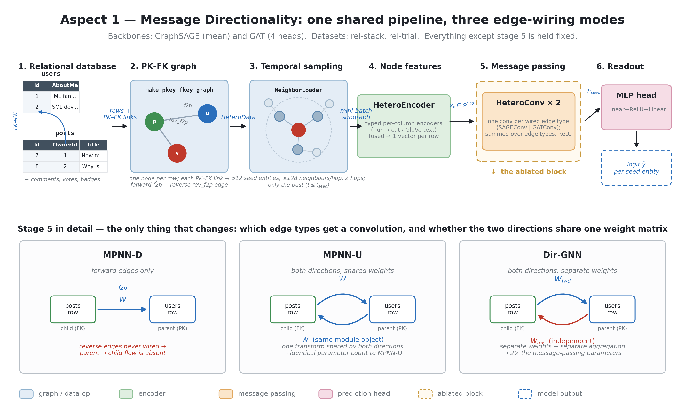
*Figure 1: shared pipeline for all six variants (2 backbones x 3 directionality modes), and how each mode wires the forward (`f2p_*`) and reverse (`rev_f2p_*`) edges.*

Every variant shares the same skeleton: a per-table `HeteroEncoder` maps each row's typed columns to a 128-dimensional vector; two message-passing layers (`SAGEConv` or `GATConv`, `heads=4` for GAT, head outputs averaged not concatenated) update node embeddings; a two-layer MLP head (`Linear(128,128) -> ReLU -> Linear(128,1)`) reads out the entity node's embedding into one logit. Only the wiring inside each `HeteroConv` layer changes between the three modes:

- **MPNN-D (directed):** only the forward edge types (`f2p_*`) get a convolution; information flows one way, from foreign-key row toward primary-key row.
- **MPNN-U (undirected):** forward and reverse edge types both get a convolution, but each reverse edge type's convolution module is literally the same object as its forward counterpart (`rel2conv[e[1]] = conv; convs[rev_e] = rel2conv[...]` in code), so the two directions share one learned transform.
- **Dir-GNN:** forward and reverse edge types each get their *own*, independently initialized convolution module, so the two directions never share weights.

### 3.3 Comparison Design

Layers, hidden size, fan-out (128 neighbors/layer/edge-type), encoders, and head are identical across all six variants; only the directionality mode and backbone change. In code, MPNN-U ties each reverse edge type's convolution to the *same module object* as its forward counterpart (`convs[e] = rel2conv[e[1][len("rev_"):]]`), so its message-passing weight count is identical to MPNN-D's by construction, not approximately similar - confirmed directly by the logged parameter counts, which match exactly between MPNN-D and MPNN-U in every one of the 12 backbone/dataset cells (e.g. rel-stack SAGE: 3,033,985 for both; rel-trial GAT: 10,266,113 for both). Dir-GNN's message-passing weights are exactly double, since every edge type gets its own, independently initialized module. At the *total* parameter level the ratio is smaller than 2x (1.13-1.56x across the four backbone/dataset combinations - see Table 1), because the shared `HeteroEncoder` contributes a fixed, mode-independent chunk of parameters that dilutes the doubling. We report all parameter counts directly rather than running a separate parameter-matched control, since Section 3.6 shows Dir-GNN's extra capacity never produces the outright best result on any backbone/dataset pair.

### 3.4 Experimental Setup

rel-stack and rel-trial, both under the global protocol (Section 2): 30-epoch budget, patience 6, 3 seeds, mean fan-out 128 per layer per edge type.

### 3.5 Results

**Table 1a - rel-stack (single-dataset, no line break needed within a dataset; datasets are separated by the thicker rule below)**

| backbone | mode | AUROC | AUPRC | precision | recall | params |
|---|---|---|---|---|---|---|
| SAGE | MPNN-D | **0.8778 ± .0025** | 0.3064 | 0.352 | 0.342 | 3.03M |
| SAGE | MPNN-U | 0.8712 ± .0036 | 0.2826 | 0.324 | 0.347 | 3.03M |
| SAGE | Dir-GNN | 0.8751 ± .0082 | 0.3028 | 0.327 | 0.357 | 3.76M |
| GAT | MPNN-D | **0.8742 ± .0079** | 0.3121 | 0.342 | 0.362 | 5.22M |
| GAT | MPNN-U | 0.8721 ± .0021 | 0.3083 | 0.333 | 0.372 | 5.22M |
| GAT | Dir-GNN | 0.8633 ± .0050 | 0.2854 | 0.336 | 0.326 | 8.13M |

---

**Table 1b - rel-trial**

| backbone | mode | AUROC | AUPRC | precision | recall | params |
|---|---|---|---|---|---|---|
| SAGE | MPNN-D | 0.6715 ± .0013 | 0.7377 | 0.605 | 0.975 | 7.29M |
| SAGE | MPNN-U | 0.6863 ± .0020 | 0.7556 | 0.626 | 0.928 | 7.29M |
| SAGE | Dir-GNN | **0.6866 ± .0002** | 0.7569 | 0.615 | 0.948 | 8.27M |
| GAT | MPNN-D | 0.6467 ± .0043 | 0.7059 | 0.603 | 0.969 | 10.27M |
| GAT | MPNN-U | 0.6642 ± .0008 | 0.7332 | 0.599 | 0.980 | 10.27M |
| GAT | Dir-GNN | **0.6644 ± .0045** | 0.7314 | 0.621 | 0.936 | 14.23M |

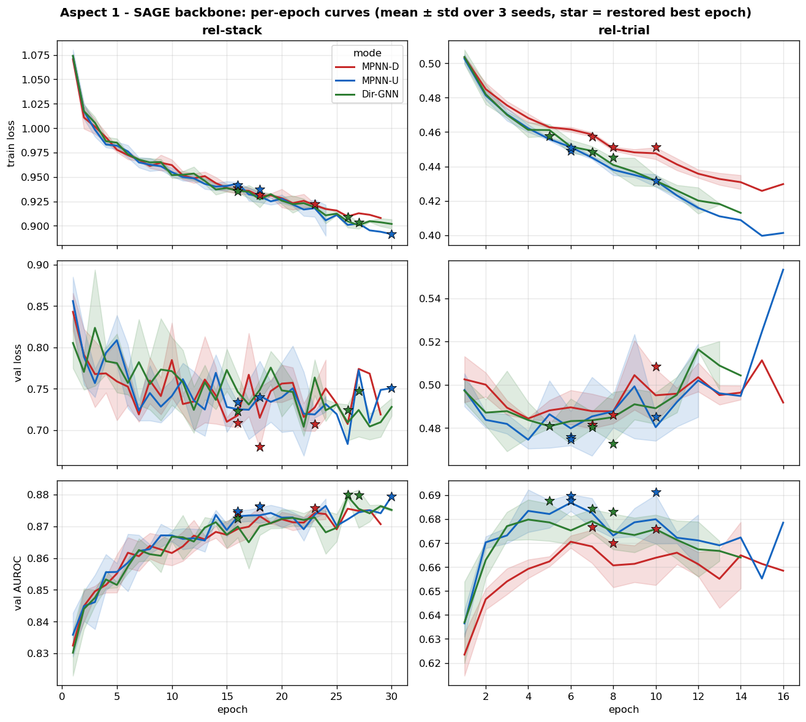
*Figure 2: SAGE backbone, all three directionality modes, per-epoch train loss / validation loss / validation AUROC, mean ± std over 3 seeds, star = restored best epoch.*

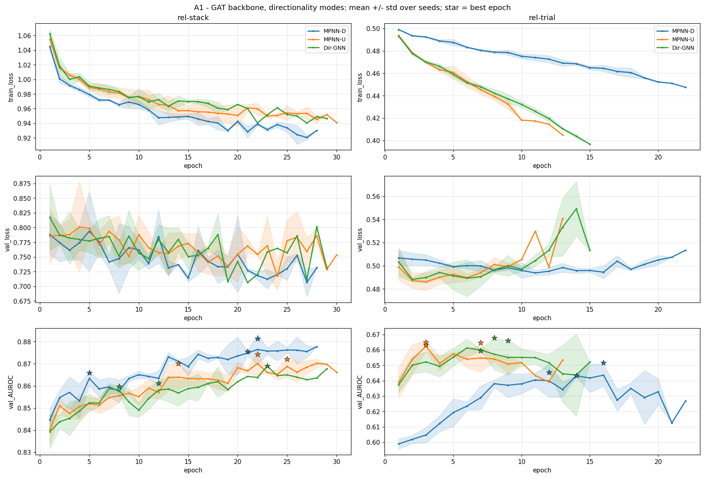
*Figure 3: GAT backbone, same layout.*

### 3.6 Convergence Analysis

We checked every one of the 36 runs (6 variants x 2 datasets x 3 seeds) against its logged training curve. 34 of 36 converged properly, either early-stopping before the 30-epoch cap or plateauing with the best epoch not at the final epoch. The two exceptions were both rel-stack, single seeds (SAGE-MPNN-D seed 42 and SAGE-Dir-GNN seed 44), where validation AUROC was still inching upward at epoch 30; given the tiny spread among rel-stack variants (0.863-0.878) this is a minor caveat, not a result-changing one. Validation AUROC at the final (patience-exhausted) epoch is modestly below its own best-epoch value in about half the runs (16 of 34 with a real gap between best and last epoch, up to 0.043 AUROC) - the ordinary noise of the patience window around a plateau, not a runaway divergence, and irrelevant to the reported numbers since the best checkpoint is restored either way. No run shows Aspect 3's `id`-style collapse (train loss to near-zero, validation loss exploding several-fold). The one real optimization anomaly is GAT-MPNN-D on rel-trial, whose validation loss stays essentially flat while training loss descends far more slowly than its MPNN-U/Dir-GNN siblings at the identical learning rate (visible in Figure 3, top row): its problem is optimization speed, not overfitting, and a dedicated confirmation run at 40 epochs and at a 3x higher learning rate raised its score only from 0.630 to about 0.648 - still the worst mode, so the gap is a real, if partially budget-sensitive, effect and not purely an artifact of under-training.

### 3.7 Discussion

**On rel-stack, all three modes are close (0.863-0.878).** MPNN-D is nominally best for both backbones, but Dir-GNN is a close second for SAGE (0.8751 vs. 0.8778) while being clearly last for GAT (0.8633). The entity table (`users`) is a parent of posts, comments, and votes, so the forward edges already pull a user's own activity into the node; reverse edges add comparatively little, which is consistent with forward-only message passing losing nothing here.

**On rel-trial, the story flips: MPNN-D is clearly the worst mode for both backbones**, by 0.015 AUROC for SAGE (0.6715 vs. 0.6863-0.6866) and 0.018-0.020 for GAT (0.6467 vs. 0.6642-0.6644). The entity table (`studies`) reaches conditions, sponsors, and interventions only through junction tables, so relevant signal sits reachable only via reverse edges; cutting them off hurts regardless of aggregation mechanism, though the effect is larger in absolute terms for GAT (both because GAT's starting point is lower and because attention over a thinner, one-directional neighborhood has less to work with than mean-aggregation does).

**Why does Dir-GNN not win outright despite having up to 1.56x the parameters of MPNN-D/U?** Its message-passing weights are exactly double by construction (a fresh, independently initialized convolution per direction instead of one shared module), but this project's four aspects consistently show that more message-passing capacity does not automatically buy better generalization on these tasks. Dir-GNN's best showing is a statistical tie with MPNN-U on rel-trial for both backbones (SAGE: 0.6866 vs. 0.6863; GAT: 0.6644 vs. 0.6642, both differences well inside one standard deviation), never an outright win - a genuinely separate mechanism (a second copy of the same message, not a new signal) appears to add little beyond what shared bidirectional weights already extract.

**Takeaway.** MPNN-U (bidirectional, shared weights) is the safest default: never far from the best mode in either backbone/dataset combination, and it avoids MPNN-D's clear failure mode on rel-trial without paying Dir-GNN's parameter cost.

---

## 4. Aspect 2 - Heterogeneity

### 4.1 Question

Does treating the graph as heterogeneous, with typed nodes and edges, outperform treating it as homogeneous, with one node type and one edge type - and does the answer depend on whether the model family is GraphSAGE or HGT?

### 4.2 Model Architecture

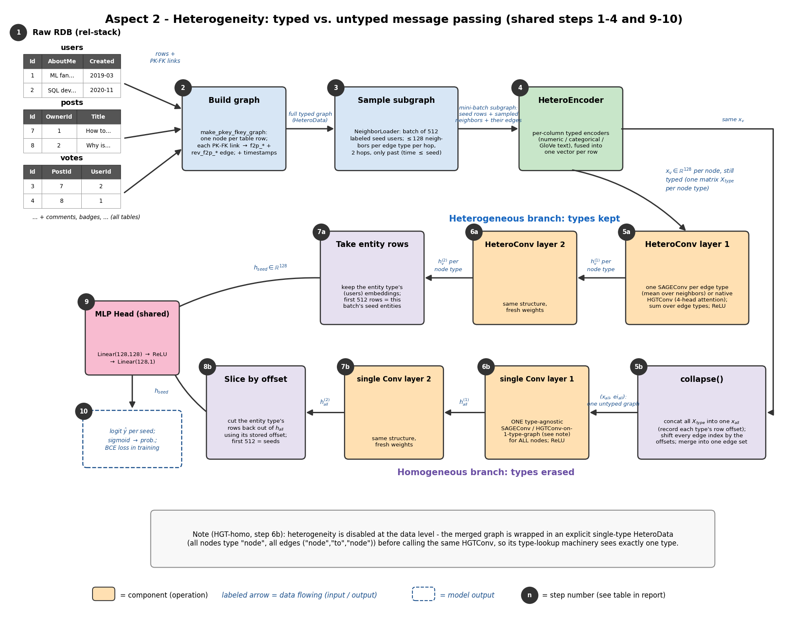
*Figure 4: heterogeneous vs. homogeneous pipelines, and the `collapse()` step that converts a typed graph into an untyped one.*

All four variants share the same per-table `HeteroEncoder`. The heterogeneous variants then run a `HeteroConv` (one `SAGEConv`, or native `HGTConv` with `heads=4`, applied per edge type) so type information is preserved through message passing. The homogeneous variants instead call `collapse()` before message passing, which does the following (this is the concrete answer to "how did you convert heterogeneous into homogeneous," per the TA's note):

1. Concatenate every node type's encoded embeddings into one matrix, recording each type's row-offset.
2. For every edge type `(s, rel, d)`, add `offsets[s]` to its source indices and `offsets[d]` to its target indices, then concatenate all edge-index tensors into one merged edge index.
3. Run **one** type-agnostic convolution on the merged `(x_all, edge_index_all)` - a plain `SAGEConv` for the SAGE-homo variant.
4. Slice the entity type's rows back out of the merged output using its stored offset, for the prediction head.

For **HGT-homo** specifically, the assignment requires literally disabling heterogeneity at the data level, not just algorithmically: we wrap the merged graph in an explicit single-type `HeteroData()` (`hom["node"].x = x_all`, `hom["node","to","node"].edge_index = ei_all`) before calling the same `HGTConv`, so its own type-lookup machinery sees exactly one node type and one edge type, matching the spec's construction exactly rather than only being computationally equivalent to it.

### 4.3 Comparison Design

Same hidden size, layers, fan-out, encoder output dimension, head, and training for all four variants; only the message-passing block differs, using the shared `HeteroEncoder` in every case so the comparison isolates heterogeneity in the message-passing step, not the input encoding. Heterogeneous models have more parameters (weight duplication per type), so we report parameter counts directly (Table 2). Because the one case where heterogeneity wins by a real margin also has more parameters (SAGE on rel-trial), we additionally ran a **parameter-matched control**: a widened homogeneous SAGE (`homo-wide`, hidden size increased until its parameter count matches hetero's, 6.72M vs. hetero's 8.27M) on rel-trial, 3 seeds.

### 4.4 Experimental Setup

rel-stack and rel-trial, global protocol (Section 2).

### 4.5 Results

**Table 2a - rel-stack**

| model | setting | AUROC | AUPRC | precision | recall | params |
|---|---|---|---|---|---|---|
| SAGE | homo | **0.8800 ± .0033** | 0.3137 | 0.340 | 0.364 | 2.38M |
| SAGE | hetero | 0.8746 ± .0034 | 0.2996 | 0.348 | 0.344 | 3.76M |
| HGT | homo | 0.8680 ± .0027 | 0.2904 | 0.322 | 0.354 | 2.46M |
| HGT | hetero | 0.8699 ± .0086 | 0.2872 | 0.320 | 0.351 | 3.60M |

---

**Table 2b - rel-trial**

| model | setting | AUROC | AUPRC | precision | recall | params |
|---|---|---|---|---|---|---|
| SAGE | homo | 0.6645 ± .0062 | 0.7195 | 0.606 | 0.967 | 6.37M |
| SAGE | homo-wide (control) | 0.6684 ± .0081 | 0.7201 | 0.609 | 0.958 | 6.72M |
| SAGE | hetero | **0.6867 ± .0038** | 0.7523 | 0.609 | 0.971 | 8.27M |
| HGT | homo | 0.6713 ± .0055 | 0.7264 | 0.615 | 0.948 | 6.45M |
| HGT | hetero | 0.6707 ± .0084 | 0.7308 | 0.618 | 0.945 | 8.77M |

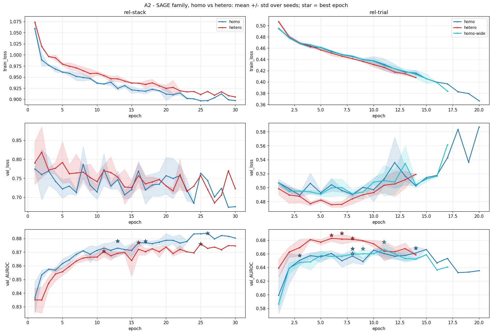
*Figure 5: SAGE family, homo vs. hetero (plus the homo-wide control on rel-trial), mean ± std over 3 seeds.*

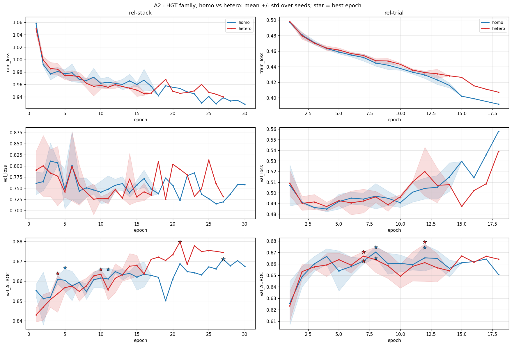
*Figure 6: HGT family, same layout.*

### 4.6 Convergence Analysis

All 27 runs (4 official variants + the 3-seed homo-wide control, x 2 datasets minus the control being rel-trial-only) converged cleanly - no missing curves and no run still climbing at the epoch cap. As in Aspect 1, roughly half the runs (13 of 27) give back a modest amount of validation AUROC (up to 0.037) between their best epoch and the final patience-exhausted epoch; this is the same ordinary plateau noise, not Aspect 3's `id`-style collapse, and does not affect the reported numbers since the best checkpoint is restored. This is a meaningfully cleaner picture than an earlier, shorter-budget pass at this aspect, where the rel-stack SAGE homo/hetero curves had not yet clearly separated by the old cutoff; the eventual homo-over-hetero gap on rel-stack (Section 4.7) is exactly the kind of slow-developing separation a shorter budget would risk missing or mis-measuring.

### 4.7 Discussion

**On rel-stack, homogeneous SAGE wins clearly** (0.8800 vs. 0.8746, a gap larger than either model's own seed-to-seed standard deviation) **while HGT is a statistical tie** (0.8699 hetero vs. 0.8680 homo, gap smaller than hetero's own std of 0.0086) - a correction from an earlier, less-converged pass at this aspect that had reported homo beating hetero for both families on rel-stack. **On rel-trial, SAGE hetero wins clearly** (0.6867 vs. 0.6645, and the gap survives against the parameter-matched homo-wide control at 0.6684 - widening homo to match hetero's parameter count closes less than a fifth of the gap) **while HGT is again a tie** (0.6707 vs. 0.6713). Across all four model/dataset pairs, heterogeneity helps outright in exactly one (SAGE/rel-trial), ties in two (both HGT pairs), and loses in one (SAGE/rel-stack) - a more mixed picture than "opposite of expectation in most cases," but still far from the clear win we originally expected.

**Why do heterogeneous models have more parameters, and does that extra capacity help?** Heterogeneous message passing duplicates weights per edge type (`HeteroConv`) or maintains separate per-type projections (`HGTConv`'s internal type-specific linear layers), so hetero always costs more parameters than homo at the same hidden size - 1.30x to 1.58x more across our four pairs. The parameter-matched control directly answers whether that capacity, not type-awareness, is what wins on rel-trial: widening homo to hetero's parameter budget only recovers a small fraction of the gap (0.6645 to 0.6684, versus hetero's 0.6867), so the win is attributable to genuine type-awareness, not just having more weights to fit with.

**Why does homogeneous do about as well or better everywhere except SAGE/rel-trial?** Sharing one set of weights across all node and edge types pools statistical strength and acts as a regularizer. rel-stack has 22 edge types and rel-trial has 30; splitting parameters across that many types trains each type-specific transform on a thinner slice of the data, which can offset the benefit of type-awareness unless the types are distinct enough and the model family is well matched to exploiting them (SAGE's simple per-type linear-then-mean transforms on rel-trial's genuinely distinct table roles - studies vs. conditions vs. sponsors - appear to hit that sweet spot; HGT's larger, attention-based per-type machinery does not clearly benefit from the same split on either dataset).

**Takeaway.** Heterogeneity is not a free win: it must be tested per model family and per dataset, and on these tasks it earns its extra parameters in only one of four combinations.

---

## 5. Aspect 3 - Node Features

### 5.1 Question

In the heterogeneous setting, how does the initial node representation affect downstream performance, model complexity, and usability?

### 5.2 Model Architecture

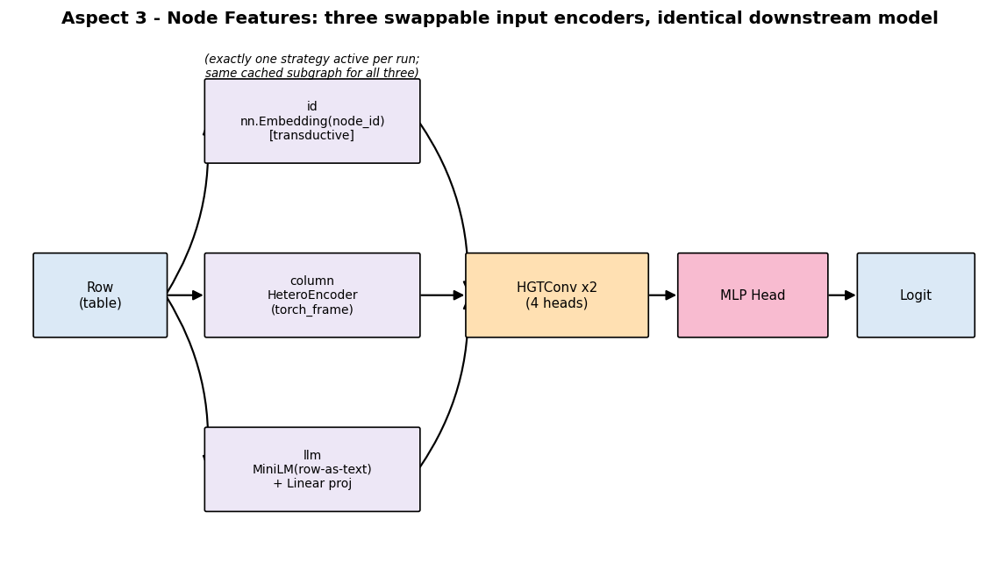
*Figure 7: three swappable input encoders feeding an identical HGT backbone and head.*

All three variants share the exact same downstream model: two `HGTConv` layers (`heads=4`) followed by the same two-layer MLP head. Only the block that produces each node's initial 128-dimensional vector changes:

- **id:** `nn.Embedding(num_nodes_of_type, 128)` per node type, looked up by the node's position in the cached subgraph - a pure lookup table, ignoring all cell values, and transductive by construction (a validation entity's own embedding is only trained if it happens to appear as a neighbor of some training entity's sampled neighborhood).
- **column:** the shared `HeteroEncoder` used everywhere else in this project (torch_frame typed-column encoders).
- **llm:** each row is serialized to a string (`"col1=v1, col2=v2, ..."`), embedded once with frozen sentence-transformers MiniLM (`all-MiniLM-L6-v2`, 384-d), and a learned per-type `Linear(384, 128)` projects it down; MiniLM itself is never fine-tuned.

### 5.3 Comparison Design

All three strategies train on one fixed, cached subsample per dataset - a label-stratified sample of seed entities (6000 train, 2000 validation) plus their 2-hop time-respecting neighborhoods, with MiniLM embeddings precomputed once for every node in the subgraph. Using the identical subsample for all three strategies is what the assignment requires, and it also makes the id encoding's transductive weakness a fair test rather than a sampling artifact: every strategy sees the same validation entities.

### 5.4 Experimental Setup

rel-stack and rel-trial, global protocol (Section 2), fan-out [6, 6] on the cached subgraph rather than the full graph.

### 5.5 Results

**Table 3a - rel-stack**

| strategy | AUROC | AUPRC | learned params |
|---|---|---|---|
| id | 0.7117 ± .0118 | 0.0556 | 25.57M |
| column | **0.8402 ± .0064** | 0.1772 | 3.60M |
| llm | 0.7849 ± .0031 | 0.1531 | 1.65M |

---

**Table 3b - rel-trial**

| strategy | AUROC | AUPRC | learned params |
|---|---|---|---|
| id | 0.5145 ± .0328 | 0.5889 | 18.40M |
| column | **0.6769 ± .0022** | 0.7386 | 8.77M |
| llm | 0.6545 ± .0045 | 0.7489 | 3.23M |

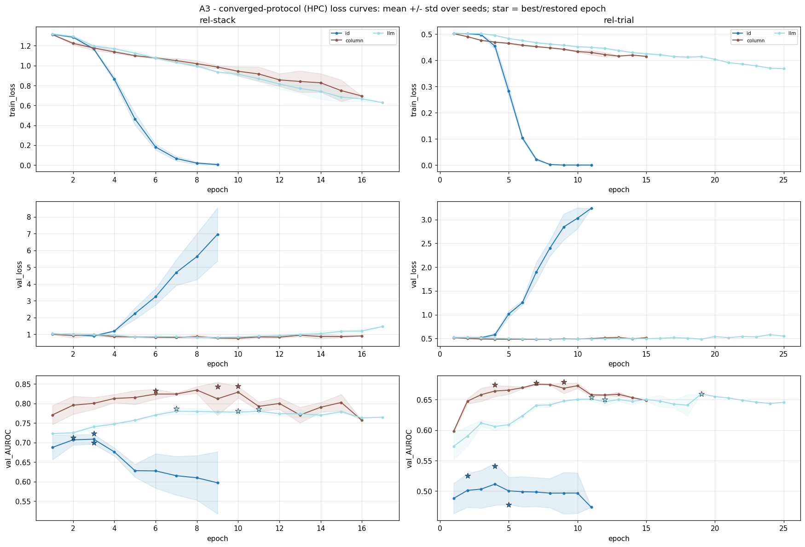
*Figure 8: all three strategies, per-epoch curves, mean ± std over 3 seeds.*

### 5.6 Convergence Analysis

All 18 runs converged with no run hitting the epoch cap still improving. The three strategies show three distinct dynamics worth reading directly off Figure 8: **id overfits hard and fast** on both datasets - train loss collapses toward 0 within about 5-6 epochs while validation loss climbs 5-9x above its own minimum over the following few epochs, and its starred best epoch lands very early (epoch 2-5), well before the collapse; early stopping is load-bearing here, not a formality. **column and llm show much milder late-training drift**, the ordinary patience-window behavior of any early-stopped model rather than a dramatic collapse: validation loss at the final epoch is at most 1.26x its best-epoch value for column and 1.68x for llm (against id's 5-9x), and validation AUROC dips by only 0.4-2.2 points for llm and typically under 1 point for column (one column/rel-stack seed is a mild outlier at -8.8 points) - real but far smaller in magnitude than id's collapse. Aspect 3 is also the only aspect with **zero** discrepancy between logged curve values and officially reported scores (Section 2), because its cached subgraph rarely has a node exceeding the [6,6] fan-out cap, so evaluation has nothing to randomly subsample - a useful contrast confirming that the small noise seen elsewhere really is a fan-out/degree effect and not a general property of our evaluation code.

### 5.7 Discussion

**The ordering is clean and consistent: column > llm > id on both datasets.** Typed column encoders carry the most signal because they preserve numeric precision and categorical structure directly; id and llm both discard or reshape that structure in different ways.

**Why does id have by far the most parameters (18-26M - 2.1x-7.1x column's and 5.7x-15.5x llm's, depending on dataset) yet the worst performance?** Its parameter count is an embedding table sized to the number of nodes in the sampled subgraph, not to the schema - about 95% of those parameters are raw per-node lookup slots that encode "which specific node this is," not any pattern transferable to a node the model has not seen trained. On rel-stack it still reaches 0.7117, meaning a user's 2-hop neighborhood carries real engagement signal even with zero cell values; on rel-trial it is close to chance (0.5145) because a validation study's own embedding was likely never updated during training, and pure connectivity carries little outcome signal there. This is a direct illustration of the point in Section 4's discussion generalized further: raw parameter count is not capacity in any useful sense when those parameters cannot transfer to unseen entities.

**Why does llm not beat column despite having a strong pretrained encoder behind it?** Two compounding reasons. First, serializing a row into one string flattens numeric and categorical structure into text tokens, discarding exactly the structure column-wise encoding preserves directly. Second, MiniLM is frozen; only a linear projection is learned on top, giving llm the fewest learned parameters of the three strategies (1.65M / 3.23M) and correspondingly the least room to adapt to the task. llm's margin over id does grow from rel-stack (+0.073) to text-heavy rel-trial (+0.140), confirming language-model embeddings do capture textual signal where it exists - just not enough to close the gap to typed encoding.

**Usability.** id is trivial to implement (an embedding table) but not transferable to new entities; column-wise needs `torch_frame` and typed-column metadata; llm needs `sentence-transformers` plus a row-serialization and embedding pipeline, the heaviest one-off preprocessing cost of the three despite its light final parameter count.

---

## 6. Aspect 4 - Limitations of Deeper Models (Oversmoothing)

### 6.1 Question

As we add layers, do node representations collapse toward each other (oversmoothing), and does that hurt downstream performance? Does adding skip connections mitigate it?

### 6.2 Model Architecture

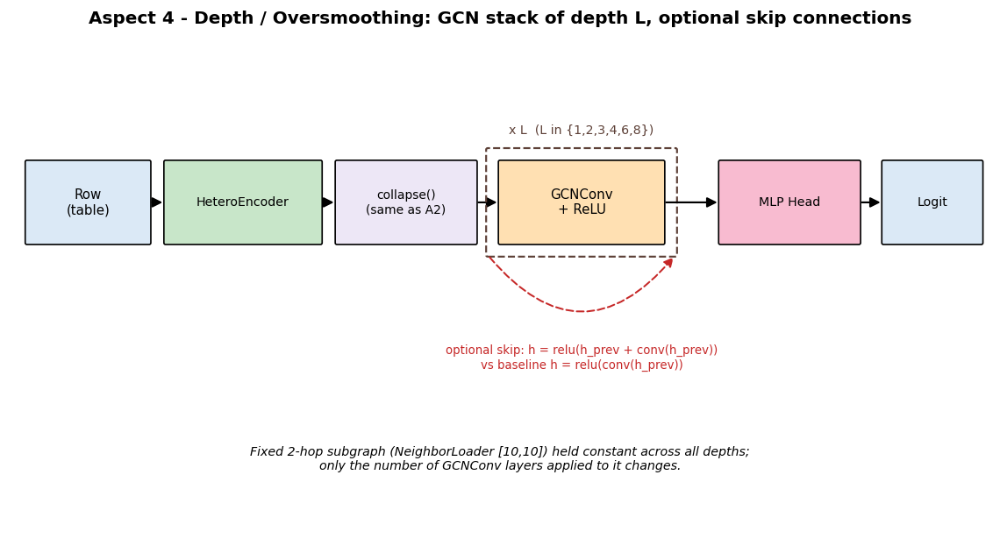
*Figure 9: the depth-configurable GCN stack, with the optional skip connection shown looping around each layer.*

A homogeneous operator (GCN was chosen because oversmoothing was first characterized in this model family): the same per-table `HeteroEncoder` as every other aspect, followed by Aspect 2's `collapse()` to merge the typed graph into one node/edge set, then `L` stacked `GCNConv` layers (`L` in `{1,2,3,4,6,8}`), then the same MLP head. Each layer computes `h = relu(conv(h_prev))` in the baseline, or `h = relu(h_prev + conv(h_prev))` in the skip variant - a residual connection carrying the previous layer's representation forward.

### 6.3 Comparison Design

The critical design choice for isolating depth is a **fixed 2-hop sampled subgraph** (`NeighborLoader` with `[10, 10]`): the subgraph handed to the model is identical across every depth setting, and only the number of `GCNConv` layers applied to it changes. This means depth here means "more propagation rounds over the same neighborhood," not "a larger receptive field" - a depth-dependent sampler would instead grow the subgraph exponentially and exceed the 8 GB budget. Encoder, features, sampled subgraph, and training budget are identical across all twelve depth/skip settings; only `L` and the presence of the skip connection change.

### 6.4 Experimental Setup

rel-stack and rel-trial, global protocol (Section 2), fan-out [10, 10], max 1000 mini-batches/epoch (this aspect trains 12 configurations per dataset per seed, so the per-epoch budget is capped tighter than Aspects 1-3).

### 6.5 Results

**Table 4a - rel-stack**

| depth | AUROC no-skip | AUROC skip | cos_sim no-skip | cos_sim skip | dir_energy no-skip | dir_energy skip |
|---|---|---|---|---|---|---|
| 1 | 0.8808 | 0.8821 | 0.453 | 0.497 | 0.720 | 0.692 |
| 2 | 0.8836 | 0.8837 | 0.676 | 0.557 | 0.290 | 0.548 |
| 3 | 0.8828 | 0.8839 | 0.576 | 0.577 | 0.375 | 0.551 |
| 4 | 0.8807 | 0.8847 | 0.720 | 0.566 | 0.247 | 0.564 |
| 6 | 0.8787 | 0.8860 | 0.709 | 0.486 | 0.262 | 0.772 |
| 8 | 0.8788 | **0.8881** | 0.712 | 0.552 | 0.390 | 0.823 |

---

**Table 4b - rel-trial**

| depth | AUROC no-skip | AUROC skip | cos_sim no-skip | cos_sim skip | dir_energy no-skip | dir_energy skip |
|---|---|---|---|---|---|---|
| 1 | 0.6704 | 0.6670 | 0.389 | 0.387 | 0.772 | 1.221 |
| 2 | 0.6829 | 0.6809 | 0.454 | 0.437 | 0.494 | 0.773 |
| 3 | **0.6893** | 0.6799 | 0.518 | 0.425 | 0.338 | 0.764 |
| 4 | 0.6857 | 0.6809 | 0.589 | 0.525 | 0.255 | 0.630 |
| 6 | 0.6729 | 0.6797 | 0.573 | 0.579 | 0.264 | 0.503 |
| 8 | 0.6757 | 0.6811 | 0.616 | 0.686 | 0.201 | 0.348 |

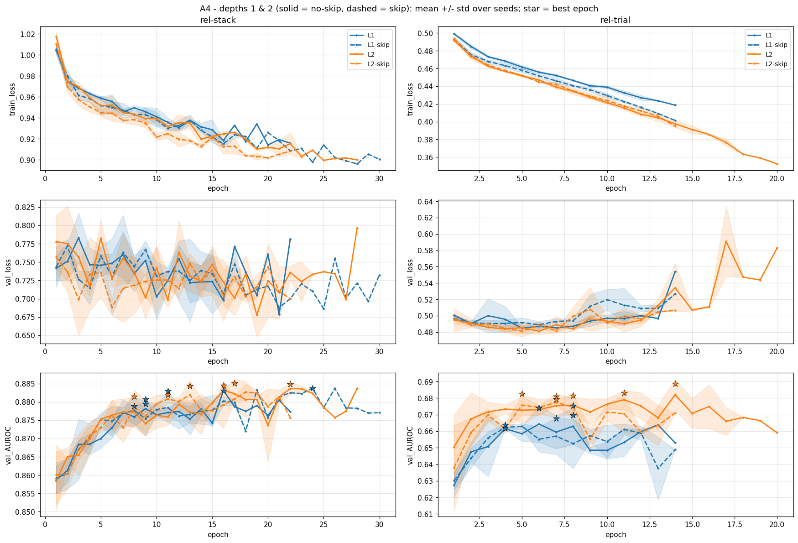
*Figure 10: depths 1 and 2, solid = no-skip, dashed = skip.*

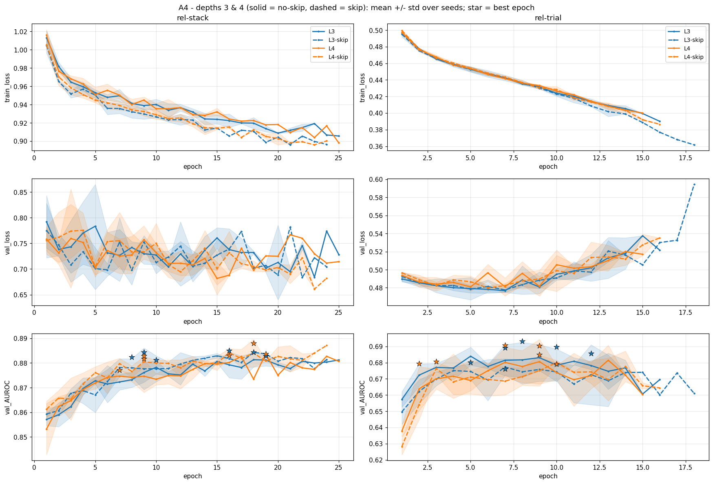
*Figure 11: depths 3 and 4, same layout.*

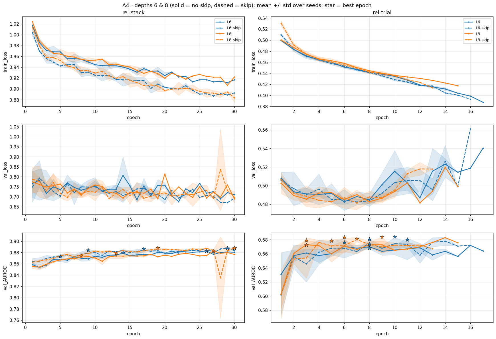
*Figure 12: depths 6 and 8, same layout - the panel where the skip-vs-no-skip separation is clearest.*

### 6.6 Convergence Analysis

69 of 72 runs converged before the epoch cap; the 3 exceptions were all rel-stack, deep-plus-skip settings (L6-skip seed 44, L8-skip seeds 42 and 43), still climbing slightly at epoch 30 - consistent with skip connections making deeper models slower but still-improving optimization problems rather than harder ones. rel-trial's best epochs land anywhere from 2 to 14 depending on depth/seed, and every run gives back some validation AUROC by its patience-exhausted final epoch (up to 0.030, comparable in scale to Aspects 1-2), alongside a correspondingly mild validation-loss rise (typically 0-20% above its best-epoch value) - the same ordinary plateau behavior seen elsewhere in this report, not a distinct or more severe pattern, and again nothing like Aspect 3's `id` collapse.

### 6.7 Discussion

**Representations measurably oversmooth with depth, cleanest on rel-stack.** Without skips, `cos_sim` rises from 0.453 at L=1 toward roughly 0.71-0.72 by L=6-8 and `dir_energy` falls from 0.720 toward 0.25-0.39 - both signatures of node embeddings converging toward each other. rel-trial shows the same direction with more noise.

**Skip connections counteract collapse at the representation level, and on rel-stack this now translates into a real downstream effect.** With the fully-converged protocol, the no-skip downstream AUROC on rel-stack actually declines mildly with depth (0.8836 at L=2 down to 0.8788 at L=8), while the skip variant *rises* with depth (0.8821 at L=1 up to 0.8881 at L=8) - the skip-vs-no-skip gap grows from a negligible +0.0013 at L=1 to a clear +0.0093 at L=8, and `dir_energy` stays far higher with skips at every depth beyond one (0.823 vs. 0.390 at L=8). This is a cleaner confirmation of the textbook oversmoothing-and-mitigation story than an earlier, shorter-budget pass at this aspect had shown. On rel-trial the pattern is noisier and closer to a genuine rise-then-fall: no-skip AUROC peaks at L=3 (0.6893) and dips through L=6 (0.6729) before partially recovering, and skip's advantage is concentrated at the largest depths (L=6, L=8), where it clearly exceeds no-skip, while trailing it at shallower depths.

**Why does downstream AUROC stay comparatively flat on rel-stack despite visible representational collapse, when the classic oversmoothing story predicts a rise-then-fall?** Two design choices we made explicitly for tractability both work against seeing a large downstream drop. First, the receptive field is fixed at 2 hops by construction - depth here adds propagation *rounds* over the same neighborhood, not new information, so a deeper model mostly re-mixes signal the first layer or two already captured rather than losing access to it. Second, early stopping selects the best validation checkpoint for every depth, which absorbs much of the optimization difficulty that would otherwise show up as a widening performance gap for deeper, harder-to-train models. A full-graph or growing-receptive-field version of this experiment, infeasible under our 8 GB budget, would be a natural way to test whether a stronger downstream collapse appears once depth also means "sees more of the graph," not just "processes the same neighborhood more times."

### 6.8 Limitations

This study uses one model family, GCN, as the assignment allows, and the fixed-subgraph design specifically tests additional propagation rounds rather than a genuinely growing receptive field. The smoothing measures (`cos_sim`, `dir_energy`) are similarity metrics in the spirit of Tutorial 7 rather than exact reproductions of its formulas: `cos_sim` is a global mean pairwise cosine over a random node sample rather than neighbor-restricted, and `dir_energy` is computed on L2-normalized embeddings, making it proportional to a neighbor `(1 - cosine)` quantity rather than the tutorial's raw-embedding Dirichlet energy; both remain valid monotone collapse indicators.

---

## 7. Aspect 5 - Foundation Models (Dry Question)

We take HGT, one of our heterogeneous models, and describe what must change for it to be pretrained on one database and reused on another database with a different schema, so that pretraining can help.

**Required changes.**

- **Schema-agnostic input.** Replace per-table, per-column learned encoders with encoders keyed by semantic column type and shared across datasets, plus a frozen shared text encoder for text columns. Normalize feature spaces so new tables map into the same representation space.
- **Schema-agnostic message passing.** HGT currently uses separate weights per node type and relation, which ties it to one schema. Replace this with parameters generated from relation and type metadata, such as a hypernetwork or relation meta-embeddings, so unseen types and relations can be handled at transfer time.
- **Task-agnostic pretraining objective.** Pretrain with self-supervision that does not require task labels, such as masked attribute reconstruction, PK-FK link prediction, or a contrastive node objective.
- **Transferable readout.** Detach the task-specific head. For a new dataset, attach a fresh head and either linear-probe or fine-tune the pretrained backbone.

**Proposed experiment.** Pretrain on a source dataset using a self-supervised objective, then evaluate on a target dataset under three settings: training from scratch, pretrain then fine-tune, and pretrain then linear-probe. Plot the four metrics against the fraction of target labels used in a few-shot curve. Pretraining is effective if it beats training from scratch, especially in the low-label regime.

---

## 8. Summary

### 8.1 Overview

**Aspect 1 - Message directionality.** We compared MPNN-D, MPNN-U, and Dir-GNN under identical encoders, depth, fan-out, and training, on both GraphSAGE and GAT. We found directionality has only a small effect on rel-stack (all modes within 0.86-0.88 for both backbones), but a clear one on rel-trial, where forward-only MPNN-D underperforms bidirectional passing for both backbones (by 0.015-0.020 AUROC), most severely for GAT. Dir-GNN never wins outright despite its extra parameters, at best tying MPNN-U. MPNN-U (bidirectional, shared weights) is the safest default.

**Aspect 2 - Heterogeneity.** We compared homogeneous and heterogeneous versions of GraphSAGE and HGT, with a parameter-matched control on the one case where heterogeneity won by a real margin. Heterogeneity helps outright in one of four model/dataset combinations (SAGE on rel-trial, confirmed against the capacity-matched control), ties in two (both HGT pairs), and loses in one (SAGE on rel-stack). Heterogeneity is not a free win: shared parameters can pool statistical strength across many types, while type-specific parameters can fragment the data and under-train.

**Aspect 3 - Node features.** We compared id, column-wise, and LLM encodings in HGT on a shared subsample. The result is a clean, consistent ordering: column-wise > LLM > id on both datasets. Typed column encoders are the best default; id shows that graph structure alone carries some signal but generalizes poorly to unseen entities (near-chance on rel-trial); LLM features help more where the schema is text-heavy but never overtake typed encoding, since serialization discards structure a frozen encoder cannot recover.

**Aspect 4 - Depth and oversmoothing.** We tested GCN with and without skip connections across depths 1 through 8 on a fixed 2-hop receptive field. Representational collapse is clearly present and grows with depth; skip connections measurably counteract it, and on rel-stack this now translates into a real downstream gain that grows with depth (up to +0.0093 AUROC at L=8). The muted downstream effect relative to the classic oversmoothing story is attributable to the fixed receptive field (depth adds propagation rounds, not new information) and early stopping.

**Aspect 5 - Foundation models.** Turning HGT into a foundation model requires schema-agnostic input encoders, message passing that generalizes across schemas, a self-supervised pretraining objective, and a transferable head; effectiveness should be tested with a scratch-vs-fine-tune-vs-linear-probe few-shot transfer curve.

### 8.2 Future work

The main limitations are that all reported metrics are on the validation split because RelBench hides test labels, with the precision/recall threshold tuned on that same split; the depth study uses a fixed 2-hop subgraph rather than a growing receptive field; only two datasets are used; and only Aspect 2 includes a parameter-matched control. Good follow-ups would be a growing-receptive-field oversmoothing study on larger hardware, parameter-matched controls for Aspects 1, 3, and 4, fine-tuned rather than frozen LLM encoders, and additional RelBench tasks to test generality.

### 8.3 AI usage

We used an AI assistant (Claude, via Claude Code) extensively throughout this project: drafting the experimental design, writing the PyTorch Geometric / RelBench implementation of every aspect, debugging environment and library failures (a pyg-lib loading issue; an HGT grouped-GEMM CUDA crash on mini-batches with empty node types; a CUDA-version mismatch when moving training to an HPC cluster), generating figures and architecture diagrams, and drafting report text from measured results. All training runs were launched and monitored by us, and every experimental decision (datasets, tasks, backbones, ablation variants, the skip-connection mitigation, the converged-protocol rerun) was made or explicitly approved by us. Our validation process included: smoke-testing every new component end-to-end on a small dataset before touching the real datasets; verifying parameter-tying claims directly (e.g. confirming MPNN-U's reverse convolution module is the same Python object as its forward counterpart, and Dir-GNN's message-passing weights are exactly double); auditing every quoted number in this report against the saved results CSVs; cross-checking every result against its full per-epoch training curve to confirm convergence and rule out overfitting before trusting a number; and running dedicated review passes that caught and corrected real errors, including a label-alignment bug in an earlier version of the Aspect 3 subsampler, a results table left stale after a rerun, an earlier Aspect 2 conclusion (homogeneous beating heterogeneous "for both families" on rel-stack) that a fully-converged rerun showed was only true for one of the two families, and a training-budget artifact where several findings understated their true effect size until we re-ran the affected configurations to convergence. We estimate that roughly 70-80% of the code and first-draft text was AI-assisted, while the experimental decisions, all training runs, and the final validation were ours.

---

## Appendix: Requirements Coverage

| Requirement | How it is covered |
|---|---|
| RelBench datasets, entity classification | user-engagement (rel-stack), study-outcome (rel-trial), both binary |
| ROC AUC, precision, recall, AUPRC | reported for every aspect |
| Aspect 1: three modes, two or more datasets, model from {SAGE, GAT, RGCN} | GraphSAGE + GAT; MPNN-U, MPNN-D, Dir-GNN; two datasets |
| Aspect 2: homo vs hetero, two or more models, to_hetero, HGT homogenized, two or more datasets | GraphSAGE and HGT, both settings, two datasets; HGT-homo built as an explicit single-type HeteroData |
| Aspect 3: id / column-wise / LLM, HGT, hetero, two or more datasets, same sample | as designed, shared stratified subsample, 3 seeds |
| Aspect 4: GCN / GAT / SAGE-mean, similarity plus downstream, one mitigation | GCN; global-cosine and neighbour-distance similarity metrics plus the four downstream metrics; skip connections |
| Aspect 5: dry, heterogeneous model, foundation-model changes plus experiment | HGT, Section 7 |
| Comparison design and isolation | global protocol; parameter counts reported; one parameter-matched control (Aspect 2) |
| Scale handling | NeighborLoader temporal mini-batching; documented stratified subsample for the LLM experiment |
