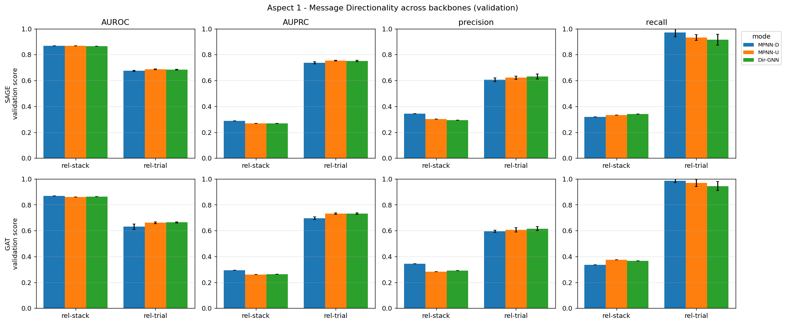
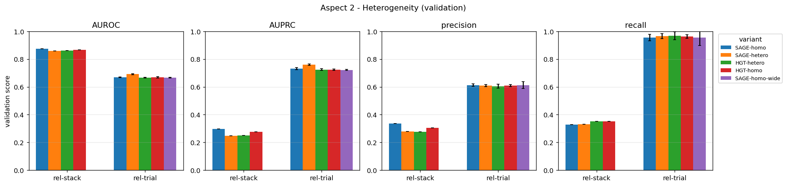
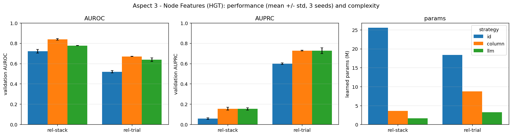
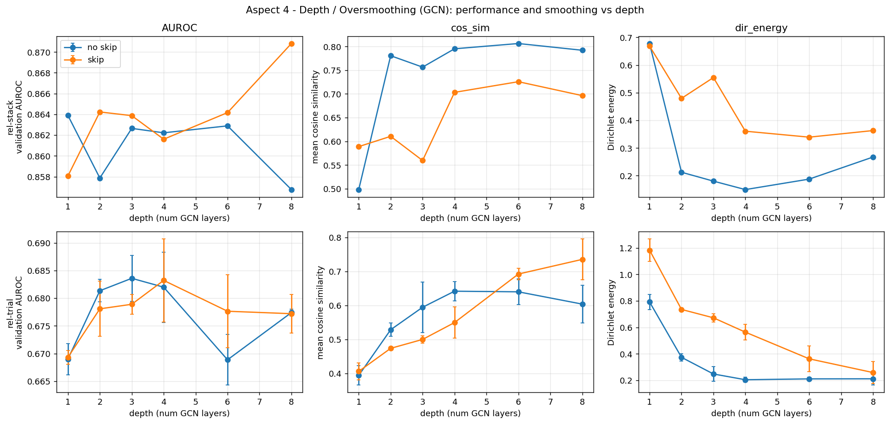

# Evaluating Aspects of Relational Deep Learning: An Ablation Study

**StructML (236605) - Final Project Report**

Authors: [NAME 1] ([ID 1]), [NAME 2] ([ID 2])

## Abstract

Relational deep learning applies graph neural networks to graphs built from relational databases. We run a controlled ablation study of four design choices in such models: message directionality, graph heterogeneity, initial node features, and network depth. All experiments use two RelBench entity-classification tasks (rel-stack user-engagement, a graph of about 4 million nodes, and rel-trial study-outcome) and report ROC AUC, AUPRC, precision and recall. Inside every comparison we keep the encoders, depth, sampling and training identical, report parameter counts, and repeat noisy runs over 3 seeds. Our main findings: (1) the effect of directionality depends on both the schema and the architecture: GAT breaks without reverse edges while GraphSAGE barely notices, so bidirectional passing with shared weights is the safe default. (2) Type-aware (heterogeneous) message passing is not a free win: a simpler type-blind model matched or beat it in three of four cases, with fewer parameters. (3) For node features, typed column encoders beat both frozen LLM row embeddings and featureless id embeddings on both datasets. (4) Deeper GCNs clearly oversmooth their representations and skip connections reduce that, but task accuracy stays flat. Our numbers match the public RelBench leaderboard level, and the leaderboard independently shows two of our findings. Code and all results are in `final.ipynb` (exported to `final.html`).

---

## 1. Introduction

Relational deep learning turns a relational database into a heterogeneous graph (one node per table row, edges along primary-key/foreign-key links) and trains message-passing GNNs on it. Many design choices go into such a model: which direction messages flow, whether types are modeled explicitly, how a row becomes an initial node vector, and how deep the network is. This project isolates each of these aspects in turn and measures its contribution on two real prediction tasks, plus a dry design question on foundation models.

## 2. Global Setup and Fair-Comparison Protocol

This protocol is shared by every aspect, so the only thing that changes inside an experiment is the aspect being studied.

### Datasets and tasks
Two rel-bench datasets, one binary entity-classification task each:

| Dataset | Task | Type | Target |
|---|---|---|---|
| rel-stack | user-engagement | binary classification | will a user contribute in the next window |
| rel-trial | study-outcome | binary classification | does a clinical study succeed |

Two very different domains (a Q&A community vs clinical trials) let us check whether each effect generalizes rather than being specific to one dataset.

### Graph construction
Each database is turned into a heterogeneous graph (`HeteroData`): one node per table row, edges following primary-key to foreign-key links. relbench stores each link as a forward edge `f2p_<key>` and a reverse edge `rev_f2p_<key>`, so by default messages can flow in both directions. Row timestamps are attached as a time attribute, and we use the temporal train / validation / test splits that rel-bench defines. Temporal splits plus time-aware neighbor sampling guarantee a node never sees information from the future.

### Default node features
For Aspects 1, 2 and 4 the initial node features come from column-wise encoders (the standard rel-bench / torch_frame encoders that map each typed column to a numeric vector), with text columns embedded by GloVe (sentence-transformers `average_word_embeddings_glove.6B.300d`, randomly projected to 128 dims to bound memory). Aspect 3 is precisely the experiment that varies this choice.

### Models and training
Each aspect uses the models its question calls for, as the assignment specifies: GraphSAGE and GAT in Aspect 1, GraphSAGE and HGT in Aspect 2, HGT in Aspect 3, GCN in Aspect 4. What is shared is everything around the model, so results stay comparable: the same per-table feature encoders, hidden size 128, two message-passing layers (except the Aspect 4 depth sweep), and a small MLP head that outputs one logit. Heterogeneous variants use one convolution per edge type (PyG `HeteroConv`, equivalent to `to_hetero`). Training is identical everywhere: `BCEWithLogitsLoss` with a positive-class weight for imbalance, Adam with a fixed learning rate, a capped number of epochs, and early stopping on validation ROC AUC.

### Handling scale
rel-stack has on the order of four million nodes, so full-graph training does not fit in 8 GB. We use `NeighborLoader` mini-batching with a fixed fan-out per layer and per edge type, and time-aware sampling. For the LLM feature experiment (Aspect 3), which is the heaviest, we take a fixed label-stratified subsample of seed entities together with their 2-hop neighborhoods and use the same subsample for all three feature strategies (details in Section 5).

### Evaluation measures
For every experiment we report ROC AUC, AUPRC (area under the precision-recall curve), precision, and recall. Precision and recall need a decision threshold; we pick the threshold that maximizes F1 on the validation set. Because rel-bench hides the test labels, **every metric is reported on the validation split**, using that best-F1 threshold. This means precision and recall are tuned and evaluated on the same split, a mild optimistic bias that is identical across variants. Seeds: on rel-stack, whose validation split has ~86k rows, metric estimates are stable across runs, and each configuration is trained once (seed 42; a rel-stack run costs 10-40 minutes). On rel-trial, whose validation split has only 960 rows, metrics are noisy and runs are cheap, so every configuration is trained with **3 seeds** (42/43/44); tables report the mean and figures show the standard deviation. Aspect 3 uses 3 seeds on both datasets. Remaining small gaps (a few thousandths of AUROC) should still be read as within noise. We also log the learnable-parameter count and training time per run.

### What "fair comparison" means here
Inside each aspect we hold everything constant - the data splits, the seeds, the hidden size, the number of layers, the neighbor fan-out, the feature encoders, the prediction head, and the training schedule - and change only the aspect under study. Some aspects unavoidably change the parameter count (for example Dir-GNN uses separate weights per direction, and heterogeneous models duplicate weights per type). For those we report the parameter counts directly, and, where the higher-capacity model actually wins, we consider a parameter-matched control (shrinking the larger model's width so the totals line up) to tell whether the gain is from the design choice or from extra capacity. Each aspect's discussion states whether that control was needed and whether we ran it.

### External sanity check (RelBench leaderboard)
Our absolute numbers line up with the public RelBench leaderboard (test-split AUROC, in %): the official RDL (GraphSAGE) baseline scores **90.6** on user-engagement and **68.6** on study-outcome, and LightGBM on raw entity features scores 63.4 / 70.1. Our GraphSAGE models reach 86.8-87.4 (validation) on user-engagement - a few points below the official run, consistent with our lighter training budget (capped steps per epoch, no relative-time encoder, 128-dim projected GloVe text features) - and 68.5-69.4 (validation) on study-outcome, matching the official level. The leaderboard also independently corroborates two of our findings: official HGT trails official GraphSAGE exactly where we found type-aware attention unhelpful (58.4 vs 68.6 on study-outcome, and 71.8 vs 75.8 mean AUROC over all classification tasks), and official GAT likewise trails GraphSAGE on study-outcome (66.2 vs 68.6), consistent with the attention model's difficulties we observed there. Leaderboard numbers are on the hidden test split and ours on validation, so the comparison is indicative rather than exact - but it places our pipeline at the expected performance level rather than an artifact of our setup.

---

## 3. Aspect 1 - Message Directionality

### 3.1 Design

**Question.** On the relational PK-FK graph, how much does the direction of message passing matter? We compare three directionality modes from module 5.

**Models.** GraphSAGE (one model is required out of GraphSAGE, GAT, RGCN), plus GAT as a second backbone to test whether findings are a property of relational message passing in general or just of GraphSAGE's mean aggregation.

**Variants.** Directionality is expressed through how the forward and reverse edge types are used:
- **MPNN-D (directed):** keep only the forward edge types (foreign key to primary key). Information flows one way.
- **MPNN-U (undirected):** use forward plus reverse edge types and aggregate them together with a single shared transform per layer (each reverse conv is literally the same module as its forward conv).
- **Dir-GNN:** use forward plus reverse edge types but with separate parameters and a separate aggregation for each direction, combined afterwards.

**Data preparation.** Same heterogeneous graph and same splits for all three; the only change is which edge directions are active and whether their parameters are shared.

**Fairness.** Identical layers, hidden size, fan-out, encoders, and head. Parameter counts confirm the isolation: MPNN-D and MPNN-U have identical GNN weights, Dir-GNN has 2x. We consider a parameter-matched Dir-GNN (reduced width) as an equal-capacity control, running it only if Dir-GNN actually turns out to win (see the discussion). The relative-time encoder is omitted for simplicity; it would be identical across variants.

**Datasets.** rel-stack and rel-trial.

**Expectation.** MPNN-U should be at least as good as MPNN-D, because reverse edges let a parent row reach its child rows. Dir-GNN should match or beat MPNN-U when direction itself carries signal (PK and FK roles are asymmetric), at the cost of more parameters; under parameter matching the gap should shrink.

### 3.2 Results

Validation AUROC (rel-stack: single seed; rel-trial: mean ± std over 3 seeds; full four-metric tables and the figure are in the notebook / `artifacts/aspect1_metrics.png`):

| dataset | backbone | MPNN-D | MPNN-U | Dir-GNN |
|---|---|---|---|---|
| rel-stack | SAGE | **0.868** | 0.867 | 0.864 |
| rel-stack | GAT  | **0.868** | 0.860 | 0.864 |
| rel-trial | SAGE | 0.675 ± 0.004 | **0.685 ± 0.003** | 0.683 ± 0.003 |
| rel-trial | GAT  | 0.630 ± 0.021 | 0.661 ± 0.007 | **0.663 ± 0.005** |

*Figure 1: Aspect 1 - validation metrics per directionality mode, GraphSAGE (top) and GAT (bottom), on both datasets. Error bars: std over 3 seeds (rel-trial).*

### 3.3 Discussion

**Finding 1 - on rel-stack, directionality barely matters, for both backbones.** MPNN-D (forward only) is best or tied-best for SAGE and for GAT, the three modes sit within ~0.008 AUROC, and Dir-GNN never wins despite ~2x the message-passing parameters. This is robust across architectures. The entity (`users`) is a parent of posts, comments and votes, so the forward `f2p` edges already pull a user's activity into the node; reverse edges mostly carry information away and add little.

**Finding 2 - on rel-trial, directionality is architecture-dependent, and this is where GAT changed the story.** For SAGE the effect is small (0.675-0.685, MPNN-U best). For GAT it is large: forward-only (MPNN-D) drops to **0.630 ± 0.021** - both the worst mean and by far the largest seed variance, i.e. unstable as well as weaker - and adding the reverse edges recovers it (MPNN-U 0.661 ± 0.007, Dir-GNN 0.663 ± 0.005). So an attention model is strongly hurt by one-directional message passing on rel-trial, while a mean-aggregation model is barely affected.

**Why does GAT care about direction on rel-trial but SAGE does not?** On rel-trial the entity (`studies`) reaches conditions, sponsors and interventions only through junction tables, so much of the signal sits two hops away and is reachable only when messages flow both ways. SAGE averages whatever neighbours it has and stays robust even when a direction is missing. GAT instead learns attention weights over neighbours; with only forward edges it has a thin, less informative neighbourhood and attention cannot compensate, so it collapses toward the base rate (its MPNN-D runs predict almost everything positive: mean recall 0.98, precision 0.60). Restoring the reverse edges gives it the neighbourhood it needs.

**Why this matters.** With GraphSAGE alone we would have concluded "message directionality barely matters." Adding GAT shows that conclusion is incomplete: for an attention-based model on a schema where key information is several hops away, directionality matters a lot. GraphSAGE's mean aggregation masked an effect that a different architecture exposes - exactly the kind of generality a single-backbone study cannot establish.

**Net takeaways.**
- Directionality is neither universally important nor universally negligible; its impact depends on the dataset (where the signal sits relative to the entity) and the architecture (attention is more sensitive than mean aggregation).
- Across all four backbone-dataset settings (twelve runs), the simplest bidirectional mode (MPNN-U) is a safe default: it is never far from the best and avoids MPNN-D's failure mode on rel-trial + GAT. Dir-GNN's separate-direction weights never meaningfully win: even on GAT/rel-trial they only tie MPNN-U within seed noise, at extra parameter cost.
- GAT is not better than SAGE here in absolute terms (comparable on rel-stack, worse on rel-trial: best GAT 0.669 vs best SAGE 0.687) and uses far more parameters; we include it for the generality of the directionality conclusion, not as a recommended model.

**On the param-matched control.** We planned a parameter-matched Dir-GNN (narrowed to MPNN-U's budget) to separate directionality from capacity, to be run if Dir-GNN actually won anywhere. It does not: in every backbone-dataset setting Dir-GNN is either behind MPNN-U or tied with it within seed noise (its closest call, GAT on rel-trial, is 0.663 ± 0.005 vs 0.661 ± 0.007) despite its extra parameters, so the control is unnecessary. Notably, our initial single-seed run *had* suggested a Dir-GNN win there (0.669 vs 0.654); averaging over 3 seeds dissolved it - a concrete demonstration of why the multi-seed protocol on rel-trial matters.

---

## 4. Aspect 2 - Heterogeneity

### 4.1 Design

**Question.** Does treating the graph as heterogeneous (typed nodes and edges) beat treating it as homogeneous (one node type, one edge type)?

**Models.** Two model families (two are required out of GraphSAGE, GAT, HGT): GraphSAGE and HGT.

**Variants.**
- **GraphSAGE, heterogeneous:** per-table feature encoders, then one convolution per edge type, implemented as a `HeteroConv` of per-edge-type `SAGEConv`s (equivalent to wrapping a homogeneous GraphSAGE with `to_hetero`) - full type awareness.
- **GraphSAGE, homogeneous:** per-table encoders (the spec's `ModuleDict`-of-per-table-encoders idea, realized with the same relbench `HeteroEncoder`; the course staff confirmed this is allowed) map every row to one shared vector form, then all node/edge type information is dropped and a single type-agnostic convolution runs on the collapsed graph.
- **HGT, heterogeneous:** native HGT using the real node and edge types.
- **HGT, homogeneous (heterogeneity disabled):** build the HeteroData so that all nodes share one type and all edges share one type, then run the same HGT. This removes type awareness while keeping the architecture identical.

**Data preparation.** The per-table encoders for the homogeneous path map each table's feature width to the shared hidden size, so rows from different tables become comparable vectors; the typed `HeteroData` is then converted to a homogeneous view (one node set, one merged edge set) before message passing. In code, the `collapse()` step concatenates the post-encoder node embeddings and offset-merges every edge type into a single edge index - equivalent to `HeteroData.to_homogeneous()` on the embedded graph - so no type information survives into message passing. The HGT-homogeneous variant additionally builds an explicit single-type `HeteroData`, exactly as the assignment specifies.

**Fairness.** Same hidden size, layers, fan-out, encoder output dimension, head, and training; all four variants share the same `HeteroEncoder`, so the comparison isolates heterogeneity in the **message passing**, not the input encoding. Heterogeneous models have more parameters (weights are duplicated per type), so we report parameter counts.

**Datasets.** rel-stack and rel-trial.

**Expectation.** Heterogeneous should beat homogeneous when node and edge types carry distinct meaning, which we expect on both schemas. The gap should narrow once parameters are matched.

### 4.2 Results

Validation AUROC and parameter counts (rel-stack: single seed; rel-trial: mean ± std over 3 seeds; full tables and `artifacts/aspect2_metrics.png` in the notebook):

| dataset | model | homo AUROC | hetero AUROC | homo params | hetero params |
|---|---|---|---|---|---|
| rel-stack | SAGE | **0.874** | 0.860 | 2.38M | 3.76M |
| rel-stack | HGT  | **0.865** | 0.861 | 2.46M | 3.60M |
| rel-trial | SAGE | 0.669 ± 0.003 | **0.692 ± 0.004** | 6.35M | 8.26M |
| rel-trial | HGT  | 0.669 ± 0.005 | 0.667 ± 0.003 | 6.43M | 8.75M |

*Figure 2: Aspect 2 - validation metrics for homogeneous vs heterogeneous message passing, GraphSAGE and HGT. Error bars: std over 3 seeds (rel-trial).*

### 4.3 Discussion

The result is the opposite of our expectation in most cases:

- **On rel-stack, homogeneous beats heterogeneous for both families** (SAGE 0.874 vs 0.860; HGT 0.865 vs 0.861, a smaller gap that sits within single-seed noise), and the homogeneous models are also ~1.1-1.4M parameters **smaller**. Heterogeneity adds capacity and *hurts*.
- **On rel-trial the effect is mixed**: heterogeneity clearly helps SAGE (0.669 → 0.692, a robust +0.023 across seeds), while for HGT the two settings are statistically tied (0.669 ± 0.005 vs 0.667 ± 0.003). HGT-hetero is the largest model (8.75M) yet never the best.
- Across all runs, heterogeneity helps in only **one of four** model/dataset combinations (SAGE on rel-trial) and never justifies its extra parameters on rel-stack.

**Why does homogeneous often win?** Sharing one set of weights across all node and edge types pools statistical strength and acts as a regulariser. The heterogeneous models split parameters across many types (rel-stack has 22 edge types, rel-trial 30), so each type-specific transform is trained on a thinner slice of the data and is more prone to over-fitting or under-training. On rel-stack, where the engagement signal is broad and behavioural, the shared transform generalises better. Heterogeneity paid off only where the types are genuinely distinct and the family could exploit them (SAGE on rel-trial: studies vs conditions vs sponsors vs eligibilities), and even there the gain was modest.

**Why doesn't type-awareness help HGT on rel-trial?** It is the largest model and must learn separate attention for 15 node types and 30 edge types, many of which are sparse or empty in any given mini-batch (the same sparsity that crashed the grouped-GEMM kernel and forced a loop-path workaround). That makes its per-type parameters hard to train, so it does no better than the homogeneous HGT.

**On the param-matched control.** We planned a param-matched comparison to separate "type-awareness" from "extra capacity". But heterogeneity loses on rel-stack *despite* having more parameters, and homogeneous already wins there with fewer - so the capacity confound runs in heterogeneity's favour and it still loses. A param-matched control would only strengthen this conclusion, so we omit it (as in Aspect 1).

**Takeaway.** Heterogeneity is not a free win. On these tasks a homogeneous model - per-table input encoders followed by shared, type-agnostic message passing - is competitive or better and cheaper. Type-aware message passing helps only when the schema's types are strongly distinct and the model family can exploit them without over-fragmenting its parameters.

---

## 5. Aspect 3 - Node Features

### 5.1 Design

**Question.** In the heterogeneous setting, how does the initial node representation affect (1) downstream performance, (2) model complexity, and (3) usability?

**Model.** HGT (required), heterogeneous, fixed across the three variants.

**Variants (only the input encoder changes).**
- **Id encoding (no-feature baseline):** ignore the cell values; give each node a learnable embedding looked up by node id. Tests how far graph structure alone can go; transductive by construction, so it cannot truly generalize to unseen entities.
- **Column-wise encoding:** the existing torch_frame typed-column encoders (these already exist - no need to implement them).
- **LLM encoding:** serialize each row to a string `"col1=v1, col2=v2, ..."` and embed it with sentence-transformers MiniLM (all-MiniLM-L6-v2, 384-d, frozen); a learned per-type linear projection maps it to the hidden size.

**Data preparation and scale.** LLM-embedding every row of a full database is infeasible, so we draw one fixed subsample per dataset and use the very same subsample for all three strategies (as the spec requires): a **label-stratified** sample of seed entities (6000 train + 2000 val), together with their 2-hop time-respecting neighborhoods. Stratification preserves each split's positive rate exactly (printed at build time), and keeping rel-bench's temporal train/val split plus per-seed timestamps preserves the temporal structure of the task. MiniLM embeddings are precomputed for every node of this subgraph and cached.

**Training protocol.** Identical to Aspects 1-2: temporal `NeighborLoader` mini-batches (fan-out [6,6]) over the fixed subgraph, same hidden size, depth, head, optimizer, and early stopping, reusing the same train/eval harness. Because runs on the subsample are cheap, we train every variant with **3 random seeds** and report mean and standard deviation - a single-seed protocol proved too noisy at this sample size.

**What we measure.** (1) The four downstream metrics on validation; (2) model complexity: learned-parameter counts and training time; (3) usability: a qualitative table covering implementation effort, dependencies, preprocessing/storage cost, and transferability.

**Datasets.** rel-stack and rel-trial.

**Expectation.** Column-wise and LLM should beat the id baseline (which cannot generalize to validation entities it has never trained embeddings for); the LLM should help most on text-rich tables (rel-trial's titles, descriptions, criteria) and least where the signal is behavioural/structural (rel-stack).

### 5.2 Results

Mean ± std over 3 seeds (full metrics in the notebook; figure: `artifacts/aspect3_metrics.png`):

| dataset | strategy | AUROC | AUPRC | learned params | train time |
|---|---|---|---|---|---|
| rel-stack | id | 0.722 ± 0.018 | 0.058 | 25.6M | 5s |
| rel-stack | column | **0.838 ± 0.008** | 0.156 | 3.6M | 13s |
| rel-stack | llm | 0.777 ± 0.001 | 0.153 | 1.6M | 8s |
| rel-trial | id | 0.519 ± 0.012 | 0.599 | 18.4M | 17s |
| rel-trial | column | **0.670 ± 0.001** | 0.727 | 8.8M | 20s |
| rel-trial | llm | 0.637 ± 0.018 | 0.727 | 3.2M | 19s |

*Figure 3: Aspect 3 - validation AUROC and AUPRC (mean ± std over 3 seeds) and learned-parameter counts for the three feature strategies.*

The qualitative usability table (implementation effort, dependencies, preprocessing cost, transferability) is in the notebook next to the figure.

### 5.3 Discussion

**Finding 1 - the ordering is clean and consistent: column-wise > LLM > id on both datasets.** The typed column encoder is the strongest representation on rel-stack (0.838) and rel-trial (0.670), the LLM second, the id baseline last. Features help, and encoders that preserve the columns' numeric and categorical structure carry the most signal.

**Finding 2 - the id baseline shows what structure alone can and cannot do.** On rel-stack, id still reaches 0.722: a user's 2-hop neighbourhood (posts, votes, comments) carries engagement signal even with no cell values at all. On rel-trial it is essentially at chance (0.519): the id embeddings of validation studies are never trained (the strategy is transductive), and pure connectivity carries little outcome signal there. It is also the least stable variant (largest seed-std) and by far the largest model - an embedding per node, 25.6M / 18.4M parameters that scale with the sample rather than the schema, so these counts are not comparable across datasets.

**Finding 3 - LLM features pay off on text, but frozen LLM features do not beat typed encoders.** The LLM's margin over id roughly doubles from rel-stack (+0.055) to text-heavy rel-trial (+0.118), confirming that language-model embeddings capture textual signal. But the LLM stays behind column-wise on both datasets: serializing a row into one string flattens numbers, categories and dates into text (losing their structure), and only a per-type linear projection is learned on top of the frozen MiniLM. On AUPRC the two are tied on rel-trial (0.727), so the remaining gap is mostly in ranking the negatives.

**Complexity and usability.** id has the most learned parameters (embedding tables) yet the worst performance; the LLM has the fewest learned parameters (frozen encoder + linear projection) but the heaviest preprocessing (serialize and embed every row once, plus storage); column-wise sits in between, with parameters that scale with the schema (rel-trial's richer schema gives 8.8M vs rel-stack's 3.6M). Usability follows the same pattern: id is trivial to implement but not transferable; column-wise needs torch_frame and typed columns; the LLM needs sentence-transformers and a preprocessing pipeline.

**Caveats.** All numbers are on the shared subsample (6000 train / 2000 val seeds per dataset), so absolute values are not comparable with the full-data aspects; rel-stack's AUPRC is low in absolute terms because its positive rate is ~2.8%. An earlier version of this experiment used transductive full-batch training on a much smaller sample and produced unstable, sometimes contradictory results across samples and seeds; the redesign (mini-batch training, a larger stratified sample, 3 seeds) is what makes the ordering above trustworthy.

---

## 6. Aspect 4 - Limitations of Deeper Models (Oversmoothing)

### 6.1 Design

**Question.** As we add layers, do node representations collapse toward each other (oversmoothing), and does that hurt downstream performance? Then, does a mitigation fix it?

**Model.** GCN (one is required out of GCN, GAT, GraphSAGE-mean); GCN is the model in which oversmoothing was first characterized. As a homogeneous-graph operator it runs on the collapsed single-type graph (per-table `HeteroEncoder` features, then the Aspect-2 collapse).

**Depth sweep.** Train the same model at depths L in {1, 2, 3, 4, 6, 8}, holding hidden size, encoders, and training schedule fixed.

**Fixed receptive field (key to isolating depth and bounding memory).** We sample a fixed 2-hop neighbourhood (`NeighborLoader` with `[10, 10]`) and vary only the number of GCN layers applied to it. The subgraph is constant across depths; the only thing that changes is how many times messages propagate over it. (A depth-L neighbour sampler would instead grow the subgraph exponentially and run out of memory.)

**Oversmoothing measures (similarity metrics in the spirit of tutorial 7).** On a fixed set of validation node embeddings we compute, at each depth, (a) a global mean pairwise cosine similarity over a random node sample (rises toward 1 as embeddings collapse) and (b) the mean squared distance between L2-normalized embeddings of connected nodes (falls toward 0 as neighbours align). These are monotone oversmoothing indicators but not tutorial 7's exact formulas: our cosine is global rather than neighbour-restricted, and normalizing before the energy makes (b) proportional to a neighbour (1 − cosine) quantity rather than the tutorial's raw-embedding Dirichlet energy. In code and figures they are labelled `cos_sim` and `dir_energy`.

**Downstream measure.** The four metrics versus depth. We expect a rise then a fall: a little depth helps, too much oversmooths and hurts.

**Mitigation (follow-up): skip / residual connections.** We re-run the same depth sweep adding residual connections (`h = relu(h_prev + conv(h_prev))`; the no-skip form is `h = relu(conv(h_prev))`) and compare the oversmoothing and performance curves.

**Datasets.** rel-stack and rel-trial (one dataset would satisfy the requirement; two make the conclusion stronger).

**Fairness.** Identical encoder, features, sampled subgraph, and training budget across all depth/skip settings; only the number of layers and the presence of the skip connection change.

**Expectation.** With depth, the similarity metrics should show collapse (cosine toward 1, neighbour energy toward 0) and downstream performance should rise then fall; skip connections should reduce both the collapse and the performance drop.

### 6.2 Results

Validation AUROC and the two smoothing metrics per depth (rel-stack: single seed; rel-trial: mean over 3 seeds; full four-metric table in the notebook).

rel-stack:

| depth | AUROC no-skip | AUROC skip | cosine no-skip | cosine skip | energy no-skip | energy skip |
|---|---|---|---|---|---|---|
| 1 | 0.864 | 0.858 | 0.498 | 0.589 | 0.678 | 0.668 |
| 2 | 0.858 | 0.864 | 0.780 | 0.610 | 0.212 | 0.479 |
| 3 | 0.863 | 0.864 | 0.756 | 0.560 | 0.180 | 0.555 |
| 4 | 0.862 | 0.862 | 0.795 | 0.703 | 0.150 | 0.361 |
| 6 | 0.863 | 0.864 | 0.806 | 0.726 | 0.187 | 0.339 |
| 8 | 0.857 | **0.871** | 0.792 | 0.696 | 0.267 | 0.363 |

rel-trial:

| depth | AUROC no-skip | AUROC skip | cosine no-skip | cosine skip | energy no-skip | energy skip |
|---|---|---|---|---|---|---|
| 1 | 0.669 | 0.669 | 0.394 | 0.406 | 0.792 | 1.183 |
| 2 | 0.681 | 0.678 | 0.528 | 0.474 | 0.373 | 0.735 |
| 3 | 0.684 | 0.679 | 0.595 | 0.500 | 0.248 | 0.672 |
| 4 | 0.682 | 0.683 | 0.642 | 0.550 | 0.204 | 0.564 |
| 6 | 0.669 | 0.678 | 0.640 | 0.692 | 0.211 | 0.362 |
| 8 | 0.677 | 0.677 | 0.604 | 0.735 | 0.211 | 0.258 |

In short: cosine rises and energy falls with depth (collapse), skips keep the collapse weaker at almost every depth, and AUROC stays flat throughout - the only clear downstream skip win is rel-stack at depth 8 (0.871 vs 0.857).

*Figure 4: Aspect 4 - validation AUROC, global cosine similarity and neighbour distance vs depth, with and without skip connections, per dataset (rel-trial: mean ± std over 3 seeds).*

### 6.3 Discussion

**What we expected.** As depth grows, node representations should collapse (cosine similarity → 1, neighbour energy → 0) and downstream performance should rise then fall. Skip connections should reduce both the collapse and the performance drop.

*Representations do oversmooth with depth.* On rel-stack the mean cosine similarity rises from 0.50 (1 layer) to ~0.80 (4-6 layers) and the neighbour energy falls from 0.68 to ~0.15, both signatures of representational collapse. rel-trial shows the same directions but more noisily. The phenomenon is real and visible.

*Skip connections reduce the representational collapse.* On rel-stack the skip model keeps the cosine similarity markedly lower and the neighbour energy higher (more spread) at every depth beyond one (at a single layer the two runs are essentially equal, ~0.67). On rel-trial the energy is also consistently higher with skips; the cosine measure there is noisier (it even crosses at depth 8). So skips do to the representations what they are supposed to.

*But downstream performance is largely robust to depth.* This is the surprising part. On both datasets validation AUROC stays roughly flat across 1-8 layers (rel-stack ~0.86, rel-trial ~0.67), with no dramatic rise-then-fall. The clearest downstream benefit of skips appears only at rel-stack's deepest setting (L=8: 0.871 vs 0.857); on rel-trial the differences are within seed noise. Representational oversmoothing happened, but it did not translate into a large drop in task performance.

**Why is the downstream effect so muted (against our expectation)?** Two factors, both partly by design:
1. *Fixed receptive field.* To bound memory we fix a 2-hop sampled subgraph and vary only the number of propagation rounds. The useful 2-hop signal is captured by the first one or two layers; extra layers re-mix the same small neighbourhood, smoothing the embeddings but not destroying the information the prediction head reads off the seed node. In the classic oversmoothing setup, depth also enlarges the receptive field, which is not the case here.
2. *Early stopping.* Each model is selected by its best validation AUROC (patience 2), which picks a good checkpoint even for deep models and hides much of the optimisation difficulty that usually penalises deep GCNs.

**Takeaways.**
- Oversmoothing as a *representational* phenomenon is clearly present and grows with depth, and skip connections measurably counteract it - most cleanly on rel-stack.
- Oversmoothing as a *performance* problem is weak on these relational tasks in our setup: the model stays close to its best across depths. The benefit of skips is real but small and concentrated at the largest depths.
- The honest reading is that representational collapse does not automatically cause task degradation here; whether it bites depends on whether the task needs information that the collapse destroys. With a 2-hop receptive field and early stopping, it mostly does not.

**Limitations.** A single model (GCN, as the assignment allows) and the fixed-subgraph design mean we test "more propagation rounds" rather than "deeper receptive field". A full-graph or growing-receptive-field setup - infeasible at this scale on 8 GB - might show a stronger downstream collapse. Two further caveats: (i) the smoothing measures are similarity metrics in the spirit of tutorial 7, not its exact formulas (see 6.1); (ii) Aspect 4 uses a lighter training budget than Aspects 1-2 (5 epochs / 300 steps vs 10 / 500) to keep the 24-model sweep affordable, so its absolute AUROC values should not be compared directly against the other aspects.

---

## 7. Aspect 5 - Foundation Models (Dry Question)

We take HGT, one of our heterogeneous models, and describe what would have to change so it could be pretrained on one database and reused on another database with a different schema, such that pretraining helps.

**Required changes.**
- **Schema-agnostic input.** Replace per-table, per-column learned encoders with encoders keyed by the column semantic type (shared across datasets), plus a shared frozen text encoder for text columns, and normalize feature spaces. Any new table then maps into the same shared space.
- **Schema-agnostic message passing.** HGT keeps separate weights per node type and per relation, tied to one fixed schema. Replace them with parameters produced from relation and type metadata (for example a small hypernetwork or a per-relation meta-embedding), so unseen types and relations are handled at transfer time.
- **Task-agnostic pretraining objective.** Pretrain with self-supervision that needs no task labels: masked attribute reconstruction, link prediction over the PK-FK edges, or a contrastive node objective.
- **Transferable readout.** Detach the task-specific head. For a new dataset, attach a fresh head and either linear-probe or fine-tune on top of the shared backbone.

**Proposed experiment to test effectiveness.** Pretrain on a source dataset self-supervised, then on a target dataset compare three settings: training from scratch, pretrain then fine-tune, and pretrain then linear-probe. Plot the four metrics against the fraction of target labels used (a few-shot curve). Pretraining is effective if it beats from-scratch, especially in the low-label regime.

---

## 8. Summary

### 8.1 Overview

**Aspect 1 - Message directionality (GraphSAGE + GAT).** We compared MPNN-D (forward only), MPNN-U (bidirectional, shared weights) and Dir-GNN (bidirectional, separate weights) under identical encoders, depth, fan-out and training. We expected bidirectional passing to dominate and Dir-GNN to add a little on top. Found: on rel-stack directionality barely matters for either backbone (all modes within ~0.008 AUROC); on rel-trial it is architecture-dependent - GAT is clearly hurt without reverse edges (0.630 vs ~0.66, with the largest seed variance) while SAGE hardly moves. Conclusion: the value of directionality depends on where the signal sits relative to the entity and on the aggregation function; MPNN-U is the safe default, and a single-backbone study would have understated the effect.

**Aspect 2 - Heterogeneity (SAGE + HGT, homogeneous vs heterogeneous).** We expected type-aware message passing to win. Found: homogeneous wins on rel-stack for both families (SAGE 0.874 vs 0.860; HGT 0.865 vs 0.861) with fewer parameters; heterogeneity helps only SAGE on rel-trial (0.669 → 0.692); for HGT on rel-trial the two settings tie. Conclusion: heterogeneity is not a free win - one shared transform pools statistical strength, while per-type parameters fragment the data across 22-30 edge types and can under-train.

**Aspect 3 - Node features (HGT; id / column-wise / LLM on one shared subsample).** We expected feature-based encodings to beat the id baseline and the LLM to shine on text. Found (3 seeds): a clear ordering **column > llm > id on both datasets** (rel-stack 0.838 / 0.777 / 0.722; rel-trial 0.670 / 0.637 / 0.519). The id baseline is near chance on rel-trial (transductive embeddings cannot generalize to unseen studies), and the LLM's margin over id roughly doubles on text-heavy rel-trial - but frozen LLM features never beat the typed column encoders, whose numeric/categorical structure the row-to-string serialization destroys. Conclusion: typed column-wise encoders are the best default; LLM features are a low-parameter alternative that pays off most on textual schemas; structure alone is not enough once evaluation requires generalizing to new entities.

**Aspect 4 - Depth and oversmoothing (GCN, skip connections).** We expected representations to collapse with depth, performance to rise then fall, and skips to mitigate both. Found: the representational collapse is clearly present (rel-stack global cosine 0.50 → ~0.80, neighbour distance 0.68 → ~0.15 by depth 4) and skip connections measurably reduce it, but downstream AUROC stays roughly flat over depths 1-8, with the clearest skip benefit only at the largest depth (rel-stack L8: 0.871 vs 0.857). Conclusion: with a fixed receptive field and early stopping, representational oversmoothing does not automatically become a performance problem; whether it bites depends on whether the task needs the information the collapse destroys.

**Aspect 5 - Foundation models (dry).** Turning our HGT into a foundation model requires schema-agnostic input encoders (keyed by semantic column type plus a shared text encoder), message-passing parameters generated from relation/type metadata instead of a fixed schema, a self-supervised pretraining objective (masked attribute reconstruction, PK-FK link prediction or contrastive), and a detachable task head. Effectiveness would be tested with a few-shot transfer curve (scratch vs fine-tune vs linear-probe against the fraction of target labels).

### 8.2 Future work

Limitations of this project: a single seed per configuration on rel-stack (justified by its large validation split, while rel-trial and Aspect 3 use 3 seeds); all metrics reported on the validation split because rel-bench hides test labels, with the precision/recall threshold tuned on that same split (a mild optimistic bias shared by all variants); parameter-matched controls were argued about but not run (justified post hoc: the larger model never meaningfully won); the depth study varies propagation rounds on a fixed 2-hop subgraph rather than a growing receptive field; and only two datasets. Good follow-ups: multi-seed replication with confidence intervals everywhere (Aspect 3 already uses 3 seeds), the param-matched Dir-GNN control, a growing-receptive-field oversmoothing study on larger hardware, fine-tuned (rather than frozen) LLM encoders, and additional rel-bench tasks to test generality.

### 8.3 AI usage

We used an AI assistant (Claude, via Claude Code) extensively in this project: drafting the experimental design, writing the PyTorch Geometric / relbench implementation of every aspect, debugging environment and library failures (a pyg-lib loading issue; an HGT grouped-GEMM CUDA crash on mini-batches with empty node types, fixed by forcing the loop path), generating the figures, and drafting the report text from the measured results. All training runs were launched and monitored by us, and every experimental decision (datasets, tasks, backbones, ablation variants, the skip-connection mitigation) was made or explicitly approved by us. Our validation process: every generated component was first smoke-tested end-to-end on the small rel-f1 dataset before touching the real datasets; parameter counts were checked against the design intent (MPNN-D = MPNN-U exactly, Dir-GNN exactly 2x the message-passing weights, encoder identical across variants); every number quoted in the report was audited against the saved results CSVs; and we ran dedicated review passes over the finished work that caught and fixed real errors the assistant had made - similarity metrics initially mislabeled as tutorial-7's exact formulas, a results table left stale after a re-run, a label-alignment bug in an earlier version of the Aspect 3 subsampler, and fairness claims stronger than what was actually run. When Aspect 3's first (transductive full-batch) design produced unstable results, we diagnosed it together (label-alignment checks, embedding re-computation checks, a linear-probe control) and redesigned the experiment with mini-batch training and 3 seeds. We estimate roughly 70-80% of the code and first-draft text was AI-assisted; the experimental decisions, all training runs, and the final validation were ours.

---

## Appendix: Requirements Coverage

| Requirement | How it is covered |
|---|---|
| rel-bench datasets, entity classification | user-engagement (rel-stack), study-outcome (rel-trial), both binary |
| ROC AUC, precision, recall, AUPRC | reported for every aspect |
| Aspect 1: three modes, two or more datasets, model from {SAGE, GAT, RGCN} | GraphSAGE + GAT; MPNN-U, MPNN-D, Dir-GNN; two datasets |
| Aspect 2: homo vs hetero, two or more models, to_hetero, HGT homogenized, two or more datasets | GraphSAGE and HGT, both settings, two datasets |
| Aspect 3: id / column-wise / LLM, HGT, hetero, two or more datasets, same sample | as designed, shared stratified subsample, 3 seeds |
| Aspect 4: GCN / GAT / SAGE-mean, similarity plus downstream, one mitigation | GCN; global-cosine and neighbour-distance similarity metrics plus the four downstream metrics; skip connections |
| Aspect 5: dry, heterogeneous model, foundation-model changes plus experiment | HGT, Section 7 |
| Fair comparison and isolation | global protocol; parameter counts reported; param-matched controls discussed per aspect (run only where the larger model wins) |
| Scale handling | NeighborLoader temporal mini-batching; documented stratified subsample for the LLM experiment |
